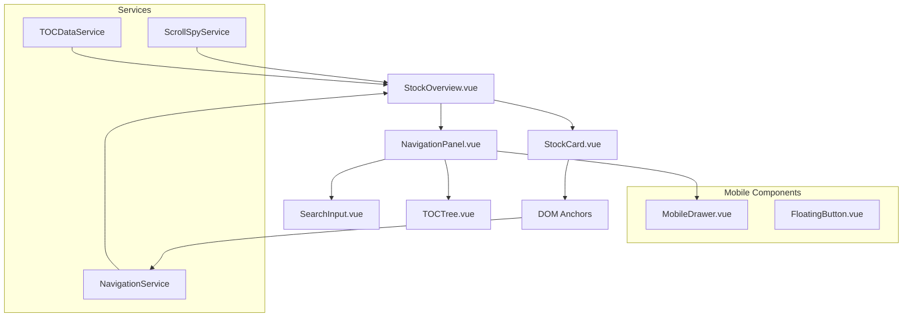

# Design Document

## Overview

本設計文件描述 Stock Overview 快速導覽功能的技術架構和實作方案。功能將在現有的 StockOverview 組件基礎上新增 Sticky TOC 和 ScrollSpy 功能，採用純 DOM scroll 方案避免與 Hash Router 衝突，並支援 Query 參數分享定位。

## Architecture

### 系統架構圖



### 資料流程

1. **初始化**: StockOverview 載入股票資料後建立 TOC 樹狀結構
2. **搜尋**: 使用者輸入搜尋關鍵字，即時過濾 TOC 樹
3. **點擊跳轉**: 點擊 TOC 項目觸發 DOM scroll 到對應 StockCard
4. **ScrollSpy**: IntersectionObserver 監控可見區域，更新 active 狀態
5. **分享**: Query 參數載入時自動跳轉到指定股票

## Components and Interfaces

### 1. NavigationPanel.vue

**Props:**
```typescript
interface NavigationPanelProps {
  tocTree: TOCNode[]
  activeSymbol: string
  searchQuery: string
  isVisible: boolean
}
```

**Events:**
```typescript
interface NavigationPanelEvents {
  'symbol-click': (symbol: string) => void
  'search-change': (query: string) => void
  'toggle-section': (sectorId: string, expanded: boolean) => void
}
```

**主要功能:**
- 渲染階層式 TOC 樹狀結構
- 處理搜尋輸入和過濾
- 管理展開/收合狀態
- 高亮 active 項目

### 2. TOCTree.vue

**Props:**
```typescript
interface TOCTreeProps {
  nodes: TOCNode[]
  activeSymbol: string
  searchQuery: string
  expandedSections: Set<string>
}
```

**功能:**
- 遞迴渲染樹狀結構
- 支援鍵盤導覽
- 處理 ARIA 屬性
- 搜尋結果高亮

### 3. MobileDrawer.vue

**Props:**
```typescript
interface MobileDrawerProps {
  isOpen: boolean
  tocTree: TOCNode[]
  activeSymbol: string
}
```

**功能:**
- 行動版抽屜介面
- 觸控手勢支援
- 自動關閉機制

### 4. ScrollSpyService

**介面:**
```typescript
class ScrollSpyService {
  private observer: IntersectionObserver
  private callback: (activeSymbol: string) => void
  
  setup(elements: Element[], callback: Function): void
  updateActiveSymbol(entries: IntersectionObserverEntry[]): void
  cleanup(): void
}
```

**功能:**
- 使用 IntersectionObserver 監控 StockCard 可見性
- 計算最佳 active 項目
- 處理 rootMargin 和 threshold 設定

### 5. NavigationService

**介面:**
```typescript
class NavigationService {
  scrollToSymbol(symbol: string, smooth?: boolean): Promise<void>
  sanitizeSymbol(symbol: string): string
  updateQueryParam(symbol: string): void
  getHeaderOffset(): number
}
```

**功能:**
- 處理 DOM scroll 跳轉
- 管理 URL Query 參數
- 計算 sticky header offset

## Data Models

### TOC 資料結構

```typescript
interface TOCNode {
  id: string
  type: 'sector' | 'industry' | 'symbol'
  label: string
  symbol?: string
  children?: TOCNode[]
  metadata?: {
    sector: string
    industry: string
    exchange: string
    marketCap?: number
  }
}

interface TOCTree {
  sectors: TOCNode[]
}
```

### 狀態管理

```typescript
interface NavigationState {
  // TOC 相關
  tocTree: TOCNode[]
  filteredTocTree: TOCNode[]
  
  // 搜尋相關
  searchQuery: string
  
  // ScrollSpy 相關
  activeSymbol: string
  
  // UI 狀態
  expandedSections: Set<string>
  isMobileDrawerOpen: boolean
  
  // 效能相關
  metadataMap: Map<string, StockMetadata>
  dailyDataMap: Map<string, DailyData>
}
```

## Correctness Properties

*A property is a characteristic or behavior that should hold true across all valid executions of a system-essentially, a formal statement about what the system should do. Properties serve as the bridge between human-readable specifications and machine-verifiable correctness guarantees.*

### Property 1: TOC 樹狀結構一致性
*For any* valid stock data set, the generated TOC tree should maintain the same hierarchical order as the main StockOverview display, ensuring sector → industry → symbol ordering matches exactly.
**Validates: Requirements 1.3, 7.3**

### Property 2: 搜尋過濾正確性
*For any* search query string, all displayed TOC items should contain the query text in their sector, industry, symbol, or company name, and no matching items should be hidden.
**Validates: Requirements 2.1, 2.2, 2.4**

### Property 3: 跳轉定位準確性
*For any* valid symbol in the TOC, clicking the symbol should scroll to position the corresponding StockCard within the visible viewport, accounting for sticky header offset.
**Validates: Requirements 3.1, 3.3**

### Property 4: ScrollSpy 同步性
*For any* scroll position, the highlighted symbol in the TOC should correspond to the StockCard with the highest intersection ratio in the current viewport within 200ms.
**Validates: Requirements 4.1, 4.2**

### Property 5: URL 參數一致性
*For any* valid symbol, accessing `?focus=SYMBOL` should result in the same scroll position as clicking that symbol in the TOC, and both should update the query parameter consistently.
**Validates: Requirements 5.1, 5.3**

### Property 6: 無障礙導覽完整性
*For any* TOC item, keyboard navigation using Tab/Enter/Space should provide the same functionality as mouse clicks, and all interactive elements should have proper ARIA attributes.
**Validates: Requirements 8.1, 8.3**

### Property 7: 行動版功能對等性
*For any* navigation action available on desktop, the mobile drawer should provide equivalent functionality with the same end result.
**Validates: Requirements 6.4, 6.5**

### Property 8: DOM 錨點唯一性
*For any* stock symbol, the generated DOM ID should be unique across the page and follow the `sym-{sanitized}` format, with proper data attributes for programmatic access.
**Validates: Requirements 9.1, 9.2, 9.5**

## Error Handling

### 1. 無效 Symbol 處理
- Query 參數包含不存在的 symbol 時，顯示警告並跳轉到頁面頂部
- 記錄錯誤日誌但不中斷使用者體驗

### 2. ScrollSpy 錯誤恢復
- IntersectionObserver 失敗時降級到 scroll event 監聽
- 提供手動重新初始化機制

### 3. 搜尋效能保護
- 搜尋輸入使用 debounce 防止過度計算
- 大量結果時限制顯示數量並提供分頁

### 4. 行動版相容性
- 不支援 IntersectionObserver 的舊瀏覽器提供 polyfill
- 觸控手勢失敗時提供按鈕替代方案

## Testing Strategy

### Unit Tests
- TOC 樹狀結構生成邏輯
- 搜尋過濾演算法
- Symbol 清理和 ID 生成
- URL 參數解析和更新

### Property-Based Tests
每個 correctness property 都需要對應的 property-based test，最少執行 100 次迭代：

**Property Test 1: TOC 一致性**
- 生成隨機股票資料集
- 驗證 TOC 順序與 groupedStocks 一致
- **Feature: stock-overview-navigation, Property 1: TOC 樹狀結構一致性**

**Property Test 2: 搜尋正確性**
- 生成隨機搜尋關鍵字
- 驗證所有結果都包含關鍵字
- **Feature: stock-overview-navigation, Property 2: 搜尋過濾正確性**

**Property Test 3: 跳轉準確性**
- 隨機選擇 TOC 項目進行跳轉測試
- 驗證目標元素在可見區域內
- **Feature: stock-overview-navigation, Property 3: 跳轉定位準確性**

**Property Test 4: ScrollSpy 同步**
- 模擬隨機滾動位置
- 驗證 active 狀態更新正確性
- **Feature: stock-overview-navigation, Property 4: ScrollSpy 同步性**

**Property Test 5: URL 參數**
- 測試各種 symbol 參數組合
- 驗證跳轉結果一致性
- **Feature: stock-overview-navigation, Property 5: URL 參數一致性**

**Property Test 6: 無障礙功能**
- 測試鍵盤導覽路徑
- 驗證 ARIA 屬性正確性
- **Feature: stock-overview-navigation, Property 6: 無障礙導覽完整性**

**Property Test 7: 行動版對等性**
- 比較桌面版和行動版操作結果
- 驗證功能一致性
- **Feature: stock-overview-navigation, Property 7: 行動版功能對等性**

**Property Test 8: DOM 錨點**
- 生成各種 symbol 格式
- 驗證 ID 唯一性和格式正確性
- **Feature: stock-overview-navigation, Property 8: DOM 錨點唯一性**

### Integration Tests
- 完整的使用者操作流程測試
- 跨瀏覽器相容性測試
- 效能基準測試（200+ symbols）

### 測試配置
使用 Vitest 作為測試框架，配置 property-based testing：
- 每個 property test 執行最少 100 次迭代
- 使用 fast-check 或類似函式庫生成測試資料
- 設定適當的 timeout 處理非同步操作