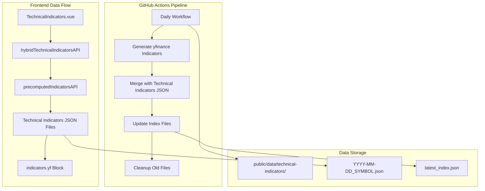

# Design Document

## Overview

This design extends the existing Technical Indicators system to include 6 additional yfinance-based indicators while maintaining full compatibility with the current 12 indicators. The solution uses a GitHub Actions-based data generation approach to avoid CORS issues and provides a seamless integration with the existing hybrid technical indicators API.

The design follows a conservative, non-breaking approach where new indicators are additive and gracefully degrade when data is unavailable. The existing TechnicalIndicators.vue component already has placeholder code for the 6 new indicators, requiring only data integration to complete the feature.

## Architecture

### High-Level Architecture



### Data Flow Architecture

1. **Generation Phase**: GitHub Actions runs daily, generating yfinance indicators for all universe symbols
2. **Storage Phase**: Data is merged into existing technical-indicators JSON files under `indicators.yf` block
3. **Retrieval Phase**: Frontend fetches data through existing hybridTechnicalIndicatorsAPI
4. **Display Phase**: TechnicalIndicators.vue renders new indicators alongside existing ones

## Components and Interfaces

### Core Components

#### 1. YFinanceIndicatorsCore (Python)
**Location**: `scripts/yfinance_indicators_core.py`
**Purpose**: Core calculation engine for yfinance indicators
**Key Methods**:
- `get_all_yfinance_indicators(symbol)`: Returns complete indicator set
- `get_volume_indicators(symbol)`: Volume and 5D average calculations
- `get_market_cap(symbol)`: Market capitalization data
- `get_beta_indicators(symbol)`: Beta coefficients for 3mo/1y/5y

#### 2. YFinanceIndicatorsGenerator (Python)
**Location**: `scripts/generate-yfinance-indicators.py`
**Purpose**: Orchestrates data generation and file management
**Key Methods**:
- `generate_all_yfinance_indicators()`: Main generation workflow
- `merge_yfinance_indicators()`: Merges data into existing JSON structure
- `update_latest_index()`: Updates index files with new indicator metadata

#### 3. Enhanced TechnicalIndicators.vue
**Location**: `src/components/TechnicalIndicators.vue`
**Purpose**: UI component displaying all technical indicators
**New Features**:
- Conditional rendering for yfinance indicators
- Specialized formatting for volume, market cap, and beta values
- Graceful fallback when yfinance data unavailable

#### 4. Extended hybridTechnicalIndicatorsAPI
**Location**: `src/utils/hybridTechnicalIndicatorsApi.js`
**Purpose**: Data access layer with yfinance integration
**Enhancement**: Automatic merging of yfinance data from `indicators.yf` block

## Data Models

### YFinance Indicators Data Schema

```typescript
interface YFinanceIndicators {
  // Volume Metrics
  volume_last_day: number | null;           // Last completed trading day volume
  volume_last_day_pct: number | null;      // % change vs previous day
  avg_volume_5d: number | null;            // 5-day average volume
  avg_volume_5d_pct: number | null;        // % change vs previous 5-day period
  
  // Market Data
  market_cap: number | null;               // Current market capitalization
  
  // Beta Coefficients
  beta_3mo: number | null;                 // 3-month beta vs benchmark
  beta_1y: number | null;                  // 1-year beta vs benchmark
  beta_5y: number | null;                  // 5-year beta vs benchmark
  
  // Metadata
  benchmark: string;                       // Beta benchmark symbol (default: "^GSPC")
  exchange_timezone: string;               // Exchange timezone
  as_of_exchange: string;                  // Timestamp in exchange timezone
  as_of_taipei: string;                    // Timestamp in Taipei timezone
  last_completed_trading_day: string;      // Date of last completed trading day
  prev_completed_trading_day: string;      // Date of previous completed trading day
  warnings: string[];                      // Any calculation warnings
  notes: string[];                         // Additional notes
}
```

### Technical Indicators JSON Structure (Enhanced)

```json
{
  "symbol": "AAPL",
  "timestamps": [...],
  "indicators": {
    "ma5": {...},
    "sma5": {...},
    "adx14": {...},
    "yf": {
      "volume_last_day": 123456789,
      "volume_last_day_pct": 0.1,
      "avg_volume_5d": 45678901,
      "avg_volume_5d_pct": -2.3,
      "market_cap": 1234567890123,
      "beta_3mo": 1.12,
      "beta_1y": 1.05,
      "beta_5y": 1.22,
      "benchmark": "^GSPC",
      "exchange_timezone": "America/New_York",
      "as_of_exchange": "2025-12-31T18:10:00-05:00",
      "as_of_taipei": "2026-01-01T07:10:00+08:00",
      "last_completed_trading_day": "2025-12-31",
      "prev_completed_trading_day": "2025-12-30",
      "warnings": [],
      "notes": []
    }
  },
  "metadata": {
    "generated": "2026-01-01T02:10:00Z",
    "yf_updated": "2026-01-01T02:15:00Z",
    "indicators": ["MA5", "SMA5", "ADX", "Volume", "5D Avg Volume", "Market Cap", "Beta 3mo", "Beta 1y", "Beta 5y"]
  }
}
```

## Correctness Properties

Now I need to analyze the acceptance criteria to create correctness properties. Let me use the prework tool:

<function_calls>
<invoke name="prework">
<parameter name="featureName">yfinance-technical-indicators

## Correctness Properties

*A property is a characteristic or behavior that should hold true across all valid executions of a system-essentially, a formal statement about what the system should do. Properties serve as the bridge between human-readable specifications and machine-verifiable correctness guarantees.*

### Property Reflection

After analyzing all acceptance criteria, I identified several areas where properties can be consolidated to eliminate redundancy:

- Volume display properties (1.1, 1.3) can be combined into a comprehensive volume display property
- Percentage change formatting properties (1.2, 1.4, 8.3) can be unified into a single formatting property
- Beta display properties (3.1, 3.2, 3.3) can be combined into a comprehensive beta display property
- Placeholder display properties (1.5, 2.3, 3.5, 7.3) can be unified into a single error handling property
- Data format properties (8.1, 8.2, 8.4, 8.5) can be combined into a comprehensive data format property

### Core Properties

**Property 1: Volume indicators display completeness**
*For any* symbol with available volume data, the technical indicators display should show both last trading day volume and 5-day average volume with their respective percentage changes
**Validates: Requirements 1.1, 1.2, 1.3, 1.4**

**Property 2: Market capitalization display formatting**
*For any* market cap value, the display should format using appropriate units (K/M/B/T) and show the value when available
**Validates: Requirements 2.1, 2.2**

**Property 3: Beta coefficients display completeness**
*For any* symbol with available beta data, the technical indicators display should show all three beta periods (3mo, 1y, 5y) formatted to 2 decimal places
**Validates: Requirements 3.1, 3.2, 3.3, 3.4**

**Property 4: Graceful degradation for missing data**
*For any* missing yfinance indicator data, the display should show "—" placeholder while preserving existing 12 indicators functionality
**Validates: Requirements 1.5, 2.3, 3.5, 6.2, 7.2, 7.3**

**Property 5: Completed trading day data integrity**
*For any* generated yfinance indicators, all volume and beta calculations should use only completed trading days with conservative logic to avoid intraday data
**Validates: Requirements 4.1, 4.2, 4.5**

**Property 6: Five-day average calculation accuracy**
*For any* symbol, the 5-day average volume calculation should compare the most recent 5 trading days against the previous 5 trading days
**Validates: Requirements 4.3**

**Property 7: Data generation completeness**
*For any* daily workflow execution, yfinance indicators should be generated for all universe symbols with failures recorded in notes
**Validates: Requirements 5.1, 5.4**

**Property 8: File retention policy compliance**
*For any* data storage operation, files older than 30 days should be removed while maintaining current data
**Validates: Requirements 5.3**

**Property 9: Status tracking accuracy**
*For any* data generation cycle, the status.json file should be updated with accurate generation timestamps and metadata
**Validates: Requirements 5.5**

**Property 10: Session-based caching efficiency**
*For any* stock overview page load, yfinance data should be fetched only once per session with proper cache busting for updates
**Validates: Requirements 6.1, 6.4**

**Property 11: Error handling resilience**
*For any* API failures or network issues, the system should log errors, retry once, and continue with available data
**Validates: Requirements 7.1, 7.4, 7.5**

**Property 12: Data format consistency**
*For any* generated yfinance data, timestamps should use ISO 8601 format, percentages should round to 1 decimal place, and incomplete data should use null values
**Validates: Requirements 8.1, 8.2, 8.3, 8.4, 8.5**

**Property 13: Non-regression guarantee**
*For any* integration of new yfinance indicators, all existing technical indicator functionality should remain unchanged
**Validates: Requirements 6.5**

## Error Handling

### Data Generation Errors
- **yfinance API failures**: Log errors, continue with available symbols, record failures in notes
- **Insufficient data for beta**: Return null values, document in notes field
- **Network timeouts**: Implement retry logic with exponential backoff
- **File system errors**: Graceful degradation, maintain existing data

### Frontend Display Errors
- **Missing yfinance data**: Show "—" placeholders, preserve existing indicators
- **Malformed data**: Validate data structure, fallback to placeholders
- **Network failures**: Retry once, show cached data if available
- **Parsing errors**: Log errors, continue with available data

### Cache and Performance Errors
- **Cache corruption**: Clear cache, regenerate from source
- **Memory constraints**: Implement data pagination for large datasets
- **Concurrent access**: Use file locking for data generation
- **Version conflicts**: Use timestamp-based conflict resolution

## Testing Strategy

### Dual Testing Approach

This feature requires both unit testing and property-based testing to ensure comprehensive coverage:

**Unit Tests**: Focus on specific examples, edge cases, and integration points
- Test specific volume formatting scenarios (1M, 1B, 1T values)
- Test beta calculation with known datasets
- Test error handling with null/undefined data
- Test UI component integration points

**Property-Based Tests**: Verify universal properties across all inputs
- Generate random volume values and verify formatting consistency
- Generate random symbol datasets and verify calculation accuracy
- Generate random error conditions and verify graceful degradation
- Generate random timestamp scenarios and verify format compliance

### Property-Based Testing Configuration

- **Testing Library**: Use fast-check for JavaScript property tests, Hypothesis for Python tests
- **Test Iterations**: Minimum 100 iterations per property test
- **Test Tagging**: Each property test must reference its design document property
- **Tag Format**: `Feature: yfinance-technical-indicators, Property {number}: {property_text}`

### Testing Coverage Requirements

**Backend Testing (Python)**:
- Property tests for yfinance data calculation accuracy
- Unit tests for error handling and edge cases
- Integration tests for file generation and cleanup
- Performance tests for batch processing

**Frontend Testing (JavaScript/Vue)**:
- Property tests for display formatting and behavior
- Unit tests for component integration and error states
- Integration tests for data fetching and caching
- Visual regression tests for UI consistency

**End-to-End Testing**:
- Workflow tests for complete data generation pipeline
- Integration tests for frontend-backend data flow
- Performance tests for page load times with new indicators
- Compatibility tests across different browsers and devices

### Test Data Management

- Use representative sample data from actual market conditions
- Generate synthetic data for edge cases and error conditions
- Maintain test data versioning for reproducible results
- Implement data anonymization for sensitive market data

The testing strategy ensures that both the mathematical accuracy of financial calculations and the robustness of the user interface are thoroughly validated across all possible inputs and conditions.