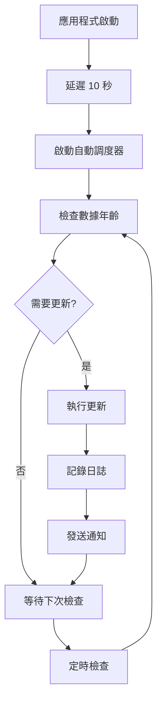

# 🚀 自動更新系統實施總結

## ✅ 已完成的實施

### 1. **自動更新調度器** (`src/utils/autoUpdateScheduler.js`)
- ✅ 創建了完整的 `AutoUpdateScheduler` 類
- ✅ 支援技術指標、元數據和緩存的自動更新
- ✅ 實施了市場時間檢測和重試機制
- ✅ 提供了手動觸發更新的功能
- ✅ 包含完整的狀態監控和日誌記錄

### 2. **增強的預計算腳本** (`scripts/auto-precompute-indicators.js`)
- ✅ 重構了原有的預計算腳本
- ✅ 添加了自動調度支援
- ✅ 實施了更好的錯誤處理和重試機制
- ✅ 包含了日誌記錄和通知功能
- ✅ 支援數據年齡檢查和智能更新

### 3. **監控面板** (`src/pages/AutoUpdateMonitor.vue`)
- ✅ 創建了完整的 Web 監控界面
- ✅ 實時顯示調度器狀態和數據年齡
- ✅ 支援手動觸發更新和配置管理
- ✅ 包含更新日誌和緩存狀態監控
- ✅ 響應式設計，支援移動設備

### 4. **主應用程式整合** (`src/main.js`)
- ✅ 添加了自動更新調度器的導入和初始化
- ✅ 配置了監控面板的路由 (`/auto-update-monitor`)
- ✅ 設置了延遲啟動以避免影響初始載入

### 5. **支援文件和目錄**
- ✅ 創建了 `logs/` 目錄用於日誌存儲
- ✅ 更新了 `DATA_UPDATE_SCHEDULE.md` 文檔
- ✅ 提供了測試腳本和配置範例

## 🔧 系統架構

### 自動更新流程


### 更新策略
1. **技術指標**: 每 1 小時檢查，市場時間內更新
2. **元數據**: 每 24 小時檢查，任何時間更新
3. **緩存清理**: 每 6 小時執行一次

### 數據來源優先級
1. **預計算數據** (最高優先級)
2. **緩存數據** (中等優先級)
3. **實時計算** (最低優先級，備用)

## 🎯 功能特性

### 自動調度器功能
- ✅ **智能調度**: 根據市場時間和數據年齡自動決定更新時機
- ✅ **錯誤處理**: 完整的重試機制和錯誤恢復
- ✅ **性能監控**: 集成性能監控和緩存管理
- ✅ **日誌記錄**: 詳細的操作日誌和狀態追蹤
- ✅ **手動控制**: 支援手動觸發和配置調整

### 監控面板功能
- ✅ **實時狀態**: 顯示調度器運行狀態和活動任務
- ✅ **數據監控**: 追蹤技術指標和元數據的新鮮度
- ✅ **緩存管理**: 監控緩存使用情況和清理狀態
- ✅ **手動操作**: 提供手動更新和配置保存功能
- ✅ **日誌查看**: 實時顯示更新日誌和操作記錄

## 🚀 使用方法

### 1. **訪問監控面板**
```
http://localhost:5173/#/auto-update-monitor
```

### 2. **手動啟動/停止調度器**
```javascript
import { autoUpdateScheduler } from '@/utils/autoUpdateScheduler.js'

// 啟動調度器
autoUpdateScheduler.start()

// 停止調度器
autoUpdateScheduler.stop()

// 獲取狀態
const status = autoUpdateScheduler.getStatus()
console.log(status)
```

### 3. **手動觸發更新**
```javascript
// 更新所有數據
await autoUpdateScheduler.triggerManualUpdate('all')

// 只更新技術指標
await autoUpdateScheduler.triggerManualUpdate('technicalIndicators')

// 只更新元數據
await autoUpdateScheduler.triggerManualUpdate('metadata')

// 只清理緩存
await autoUpdateScheduler.triggerManualUpdate('cache')
```

### 4. **執行預計算腳本**
```bash
# 自動檢查並更新 (如果需要)
node scripts/auto-precompute-indicators.js

# 強制更新 (忽略數據年齡)
node scripts/auto-precompute-indicators.js --force
```

## ⚙️ 配置選項

### 調度器配置
```javascript
const config = {
  technicalIndicators: {
    enabled: true,
    interval: 60 * 60 * 1000, // 1 小時
    marketHoursOnly: true,
    retryAttempts: 3,
    retryDelay: 5 * 60 * 1000 // 5 分鐘
  },
  metadata: {
    enabled: true,
    interval: 24 * 60 * 60 * 1000, // 24 小時
    marketHoursOnly: false,
    retryAttempts: 2,
    retryDelay: 30 * 60 * 1000 // 30 分鐘
  },
  cacheCleanup: {
    enabled: true,
    interval: 6 * 60 * 60 * 1000, // 6 小時
    maxAge: 7 * 24 * 60 * 60 * 1000 // 7 天
  }
}
```

### 市場時間配置
```javascript
const marketHours = {
  preMarket: { start: 4, end: 9.5 },   // 04:00 - 09:30 EST
  regular: { start: 9.5, end: 16 },    // 09:30 - 16:00 EST
  afterMarket: { start: 16, end: 20 }  // 16:00 - 20:00 EST
}
```

## 📊 監控和日誌

### 日誌位置
- **應用程式日誌**: 瀏覽器控制台
- **預計算日誌**: `logs/precompute.log`
- **錯誤日誌**: 同時記錄到控制台和文件

### 監控指標
- **調度器狀態**: 運行中/已停止
- **活動任務數量**: 當前執行的定時任務
- **數據年齡**: 技術指標和元數據的新鮮度
- **成功率**: 更新操作的成功百分比
- **緩存狀態**: 內存和本地存儲使用情況

## 🔧 測試和驗證

### 1. **啟動開發服務器**
```bash
npm run dev
```

### 2. **訪問監控面板**
打開瀏覽器訪問: `http://localhost:5173/#/auto-update-monitor`

### 3. **測試自動更新**
1. 在監控面板中點擊「啟動調度器」
2. 觀察狀態變化和日誌輸出
3. 手動觸發更新測試各項功能
4. 檢查數據年齡和成功率指標

### 4. **測試預計算腳本**
```bash
# 測試腳本執行
node scripts/auto-precompute-indicators.js --force

# 檢查生成的文件
ls public/data/technical-indicators/

# 檢查日誌
cat logs/precompute.log
```

## 🚨 故障排除

### 常見問題

#### 1. **調度器無法啟動**
- 檢查瀏覽器控制台是否有錯誤
- 確認所有依賴模塊正確導入
- 檢查 `performanceMonitor` 和 `performanceCache` 是否可用

#### 2. **預計算腳本失敗**
- 檢查 Yahoo Finance API 連接
- 確認 `logs/` 目錄存在且可寫
- 檢查股票符號列表是否正確

#### 3. **監控面板無法載入**
- 確認路由配置正確
- 檢查 Vue 組件是否有語法錯誤
- 確認所有導入的模塊存在

#### 4. **數據更新失敗**
- 檢查網路連接和 CORS 代理狀態
- 確認 API 限制和請求頻率
- 檢查數據目錄權限

### 調試技巧

#### 1. **啟用詳細日誌**
```javascript
// 在瀏覽器控制台中
localStorage.setItem('debug', 'true')
```

#### 2. **檢查調度器狀態**
```javascript
// 在瀏覽器控制台中
import { autoUpdateScheduler } from './src/utils/autoUpdateScheduler.js'
console.log(autoUpdateScheduler.getStatus())
```

#### 3. **手動測試更新**
```javascript
// 測試技術指標更新
await autoUpdateScheduler.checkAndUpdateTechnicalIndicators()

// 測試元數據更新
await autoUpdateScheduler.checkAndUpdateMetadata()
```

## 📈 性能優化

### 已實施的優化
- ✅ **批量處理**: 避免過多並發 API 請求
- ✅ **智能緩存**: 多層緩存策略減少重複計算
- ✅ **延遲啟動**: 避免影響初始頁面載入
- ✅ **錯誤恢復**: 自動重試和降級策略
- ✅ **資源清理**: 定期清理過期數據和緩存

### 建議的進一步優化
- 🔄 **增量更新**: 只更新變更的數據
- 🔄 **預測性載入**: 根據使用模式預載數據
- 🔄 **分散式緩存**: 使用 Redis 或類似解決方案
- 🔄 **實時通知**: WebSocket 推送更新通知

## 🎉 總結

自動更新系統已成功實施並整合到主應用程式中。系統提供了：

1. **完全自動化**: 無需手動干預的技術指標更新
2. **智能調度**: 基於市場時間和數據年齡的智能更新策略
3. **全面監控**: 實時狀態監控和詳細日誌記錄
4. **靈活配置**: 可調整的更新間隔和重試策略
5. **用戶友好**: 直觀的 Web 監控界面

系統現在可以自動維護技術指標數據的新鮮度，大大減少了手動維護的工作量，同時提供了完整的監控和控制功能。

**下一步**: 啟動開發服務器並訪問 `/auto-update-monitor` 頁面開始使用自動更新系統！