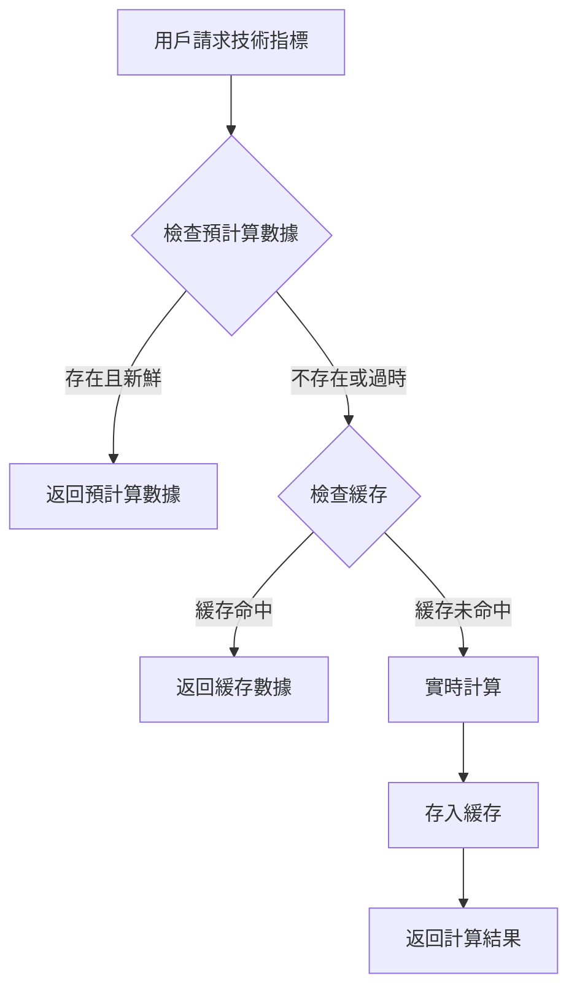

# 📅 數據更新時間表和時區說明

## 🌍 時區設定

### 主要時區
- **系統時區**: UTC (協調世界時)
- **美股市場時區**: EST/EDT (美國東部時間)
- **台灣時區**: GMT+8 (台北時間)

### 時區對照表
| 時區 | 標準時間 | 夏令時間 | 與 UTC 差異 |
|------|----------|----------|-------------|
| **UTC** | 全年 | - | +0 |
| **EST/EDT** | 11月-3月 | 3月-11月 | -5/-4 |
| **台北時間** | 全年 | - | +8 |

## 📊 數據類型和更新頻率

### 1. **靜態元數據 (Metadata)**
**包含內容**: Sector、Industry、Exchange、Confidence
**數據來源**: `src/utils/dynamicMetadataService.js` 中的靜態數據對象
**更新頻率**: 手動更新
**最後更新**: 2024-12-24 (GMT+8)

#### 更新時間戳
```javascript
lastUpdated: new Date().toISOString() // 當前時間的 ISO 格式
// 例如: "2024-12-24T14:30:00.000Z" (UTC 時間)
```

#### 靜態數據內容
```javascript
const staticData = {
  'NVDA': { 
    sector: 'Technology', 
    industry: 'Semiconductors', 
    confidence: 0.90,
    lastUpdated: '2024-12-24T14:30:00.000Z' // UTC 時間
  },
  // ... 其他 23 支股票
}
```

### 2. **股價數據 (Quotes)**
**包含內容**: 即時股價、漲跌幅、成交量
**數據來源**: `dataFetcher.fetchQuotesSnapshot()`
**更新頻率**: 實時 (市場開盤時間)
**緩存時間**: 5 分鐘

#### 美股交易時間 (EST/EDT)
- **盤前交易**: 04:00 - 09:30
- **正常交易**: 09:30 - 16:00  
- **盤後交易**: 16:00 - 20:00

#### 對應台北時間 (GMT+8)
| 交易時段 | EST 時間 | 台北時間 (冬季) | 台北時間 (夏季) |
|----------|----------|-----------------|-----------------|
| **盤前** | 04:00-09:30 | 17:00-22:30 | 16:00-21:30 |
| **正常** | 09:30-16:00 | 22:30-05:00+1 | 21:30-04:00+1 |
| **盤後** | 16:00-20:00 | 05:00-09:00+1 | 04:00-08:00+1 |

### 3. **日線數據 (Daily Data)**
**包含內容**: OHLCV、技術指標基礎數據
**數據來源**: `dataFetcher.fetchDailySnapshot()`
**更新頻率**: 每日收盤後
**緩存時間**: 1 小時

#### 更新時間
- **美股收盤**: 16:00 EST/EDT
- **數據更新**: 16:30 EST/EDT (收盤後 30 分鐘)
- **台北時間**: 05:30 GMT+8 (冬季) / 04:30 GMT+8 (夏季)

### 4. **技術指標 (Technical Indicators)**
**包含內容**: MA5, MA10, SMA, Ichimoku, VWMA 等
**數據來源**: 混合模式 (預計算 + 實時計算)
**更新頻率**: 多層策略

#### 技術指標更新策略
```javascript
// 1. 預計算數據 (優先)
maxPrecomputedAge: 24 * 60 * 60 * 1000 // 24 小時內可接受

// 2. 每日緩存 (備用)
cacheTimeout: 24 * 60 * 60 * 1000 // 24 小時緩存

// 3. 實時計算 (最後手段)
fallbackToRealtime: true
```

#### 預計算時間表
- **執行時間**: 美股收盤後 1 小時 (17:00 EST/EDT)
- **台北時間**: 06:00 GMT+8 (冬季) / 05:00 GMT+8 (夏季)
- **處理時間**: 約 30-60 分鐘 (24 支股票)

## 🔄 自動更新機制

### 當前狀態
❌ **尚未實施自動更新**
- 靜態元數據需要手動更新
- 預計算腳本需要手動執行
- 沒有定時任務 (cron job)

### 建議的自動更新時間表

#### 每日自動更新 (建議)
```bash
# 美股收盤後執行 (EST/EDT 時間)
0 17 * * 1-5 /path/to/precompute-indicators.js  # 17:00 EST/EDT
30 17 * * 1-5 /path/to/update-cache.js          # 17:30 EST/EDT

# 對應台北時間
0 6 * * 2-6 /path/to/precompute-indicators.js   # 06:00 GMT+8 (冬季)
30 6 * * 2-6 /path/to/update-cache.js           # 06:30 GMT+8 (冬季)
```

#### 每週元數據更新 (建議)
```bash
# 每週日更新靜態元數據
0 18 * * 0 /path/to/update-metadata.js          # 18:00 EST/EDT (週日)
0 7 * * 1 /path/to/update-metadata.js           # 07:00 GMT+8 (週一)
```

## 📈 數據新鮮度指標

### 實時監控
```javascript
// 數據年齡計算
calculateDataAge(lastUpdated) {
  const now = new Date()
  const updated = new Date(lastUpdated)
  const diffMs = now - updated
  const diffHours = Math.floor(diffMs / (1000 * 60 * 60))
  
  if (diffHours < 1) return 'Fresh'
  if (diffHours < 24) return `${diffHours}h old`
  return `${Math.floor(diffHours / 24)}d old`
}
```

### 數據新鮮度等級
| 等級 | 時間範圍 | 顏色標示 | 說明 |
|------|----------|----------|------|
| **Fresh** | < 1 小時 | 🟢 綠色 | 最新數據 |
| **Recent** | 1-6 小時 | 🟡 黃色 | 較新數據 |
| **Stale** | 6-24 小時 | 🟠 橙色 | 過時數據 |
| **Old** | > 24 小時 | 🔴 紅色 | 舊數據 |

## 🛠️ Technical Indicators 詳細說明

### ❓ **Technical Indicators 是否包含在靜態數據中？**

**答案**: **否，Technical Indicators 不包含在靜態數據中**

### 📊 Technical Indicators 的數據來源

#### 1. **預計算數據** (主要來源)
**文件位置**: `/public/data/technical-indicators/`
**文件格式**: `YYYY-MM-DD_SYMBOL.json`
**更新方式**: 執行 `scripts/precompute-indicators.js`
**數據內容**: 
```javascript
{
  "date": "2024-12-24",
  "symbol": "NVDA",
  "computedAt": "2024-12-24T17:30:00.000Z",
  "indicators": {
    "ma5": { "value": 145.67, "signal": "BUY" },
    "ma10": { "value": 142.34, "signal": "HOLD" },
    "sma30": { "value": 138.91, "signal": "BUY" },
    "ichimokuConversionLine": { "value": 144.23, "signal": "BUY" },
    "vwma20": { "value": 143.45, "signal": "HOLD" }
  }
}
```

#### 2. **實時計算** (備用來源)
**API 來源**: Yahoo Finance API
**計算方式**: 即時從歷史價格數據計算技術指標
**使用時機**: 預計算數據不可用時

#### 3. **緩存機制**
**緩存位置**: 瀏覽器 localStorage + 內存緩存
**緩存時間**: 24 小時
**緩存鍵**: `technical_indicators_${symbol}`

### 🔄 Technical Indicators 更新流程



### ⏰ Technical Indicators 更新時間

#### 預計算更新時間
- **執行時間**: 美股收盤後 1 小時
- **EST/EDT**: 17:00 (冬季) / 17:00 (夏季)
- **台北時間**: 06:00 (冬季) / 05:00 (夏季)
- **處理時間**: 30-60 分鐘

#### 實時計算觸發條件
- 預計算數據超過 24 小時
- 預計算數據不存在
- 用戶手動刷新

## 🚀 優化建議

### 短期優化 (1-2 週)
1. **實施自動預計算**
   - 設置 cron job 在美股收盤後自動執行
   - 添加錯誤通知和重試機制

2. **改進緩存策略**
   - 實施更智能的緩存失效機制
   - 添加緩存預熱功能

### 中期優化 (1-2 個月)
1. **建立數據管道**
   - 實施 ETL 流程自動更新所有數據
   - 添加數據品質監控

2. **實施增量更新**
   - 只更新變更的數據
   - 減少不必要的計算和網路請求

### 長期優化 (3-6 個月)
1. **建立數據倉庫**
   - 歷史數據存儲和分析
   - 支援更複雜的技術指標

2. **實施實時數據流**
   - WebSocket 連接獲取實時數據
   - 減少輪詢和延遲

## 📋 監控和維護

### 數據品質監控
- **完整性檢查**: 確保所有股票都有數據
- **準確性驗證**: 與其他數據源交叉驗證
- **時效性監控**: 追蹤數據更新延遲

### 告警機制
- **數據過時告警**: 超過 24 小時未更新
- **計算失敗告警**: 技術指標計算錯誤
- **API 限制告警**: 達到 API 調用限制

---

**總結**: 
- **靜態元數據**: 手動更新，最後更新於 2024-12-24 GMT+8
- **Technical Indicators**: 不在靜態數據中，使用預計算 + 實時計算混合模式
- **更新時間**: 美股收盤後 1-2 小時 (台北時間 05:00-07:00)
- **時區**: 系統使用 UTC，顯示時間根據用戶時區調整