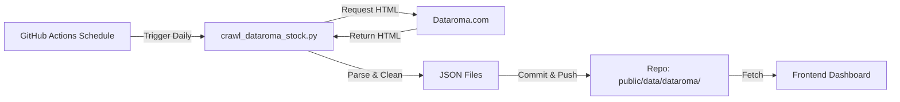

# Dataroma Integration & Data Flow

本文檔說明 Investment Dashboard 中的 Dataroma 數據整合機制，包含爬蟲邏輯、資料流向、JSON 結構定義以及自動化排程。

## 1. System Overview

本系統透過 Python 爬蟲定期抓取 Dataroma 網站上的個別股票數據，並將其轉換為靜態 JSON 檔案供前端使用。此架構確保了前端讀取的效能（無需即時爬取）並降低了對來源網站的負載。

### Data Pipeline


## 2. Scraping Mechanism

*   **Script Location**: `scripts/crawl_dataroma_stock.py`
*   **Target Pages**:
    *   Overview: `/m/stock.php?sym={TICKER}`
    *   Activity: `/m/activity.php?sym={TICKER}&typ=a`
    *   Insider: `/m/ins/ins.php?t=y&sym={TICKER}&o=fd&d=d`
*   **Risk Mitigation**:
    *   **Random Delay**: 每次請求間隔 3~8 秒隨機等待。
    *   **User-Agent Rotation**: 隨機切換瀏覽器標頭。

## 3. Data Structure (JSON Schema)

檔案路徑：`public/data/dataroma/{TICKER}.json`

### Root Object
| Key | Type | Description |
| :--- | :--- | :--- |
| `ticker` | String | 股票代號 (e.g., "PL") |
| `updated_at` | String | 資料更新時間 (ISO format) |
| `stats` | Object | 股票基本統計 |
| `superinvestors` | Array | 目前持有該股的超級投資人列表 |
| `activity` | Object | 季度大戶買賣活動 |
| `insiders` | Object | 內部人交易紀錄 |

### Detailed Objects

#### `stats`
```json
{
  "sector": "Industrials",          // 產業分類
  "ownership_count": 1,             // 持有該股的大戶總數
  "ownership_rank": 727,            // Dataroma 排名
  "percent_of_portfolios": "0.021%" // 在所有大戶組合中的佔比
}
```

#### `superinvestors` (Array Item)
```json
{
  "manager": "Meridian Contrarian Fund", // 基金/經理人名稱
  "percent_portfolio": 1.72,             // 佔該基金組合的百分比
  "recent_activity": "Reduce 31.93%",    // 最近操作
  "shares": 724958,                      // 持有股數
  "value": 9410000                       // 持有價值 (USD)
}
```

#### `activity` (Keyed by Quarter)
```json
"Q3 2025": [
  {
    "manager": "Meridian Contrarian Fund",
    "action": "Reduce 31.93%",
    "type": "Sell",            // "Buy" or "Sell"
    "shares_changed": -340000  // 股數變化量 (負數為賣出)
  }
]
```

#### `insiders`
```json
"summary": {
  "buys": { "count": 0, "amount": 0 },
  "sells": { "count": 9, "amount": 21464578 } // 總賣出金額
},
"transactions": [
  {
    "filing_date": "23 Jan 2026 18:33",
    "reporter": "ROBINSON KRISTEN",  // 申報人
    "relationship": "Director",      // 職稱/關係
    "transaction_date": "21 Jan 2026",
    "transaction_type": "Sale",      // 交易類型
    "shares": 47835,
    "price": 26.96,
    "value": 1289632                 // 交易總金額
  }
]

## 4. Automation & Maintenance

### GitHub Workflow
*   **File**: `.github/workflows/dataroma_stock_update.yml`
*   **Frequency**: 每日 UTC 00:00 執行。
*   **Permissions**: `contents: write` (允許推送資料更新)。

### Derived Metrics

### Smart Money Trend (Chip MFI)
We combine Dataroma data (Elite Funds Activity) with avg stock price to generate a dual-axis trend chart, helping identifying accumulation/distribution phases.

Detailed specification can be found in `docs/SMART_MONEY_SCORE_SPEC.md`.

## Update Frequency
- **Crawler**: Runs daily via Github Actions (`dataroma_stock_update.yml`).
- **Data**: New data is committed to `public/data/dataroma/*.json`.
- **Frontend**: `StockDetail.vue` fetches the latest JSON on load.

### Batch Processing (Complete Refresh)
若需一次更新所有監控股票 (例如 130+ 支股票)，可使用批次腳本：
```bash
python scripts/batch_crawl_dataroma.py
```
*   **耗時預估**：約 45 分鐘 (每支股票約 20 秒，含隨機延遲)。
*   **來源清單**：自動讀取 `scripts/data/category_universes.py` 與基礎清單。

### Adding New Tickers
要在監控清單中加入新股票，請修改 Workflow 檔案中的 `TICKERS` 變數：

```yaml
- name: Crawl Dataroma Data
  run: |
    # Modify this list to add more stocks
    TICKERS=("PL" "NVDA" "TSLA" "AAPL") 
```
