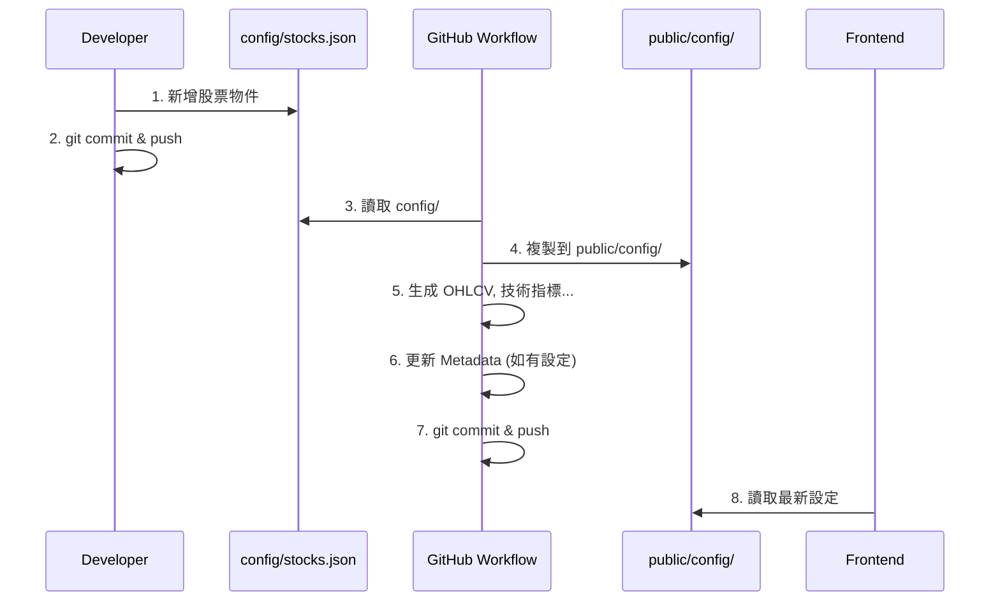
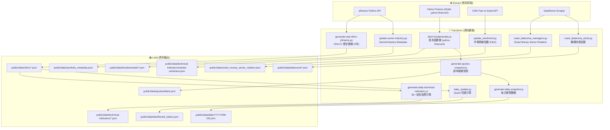
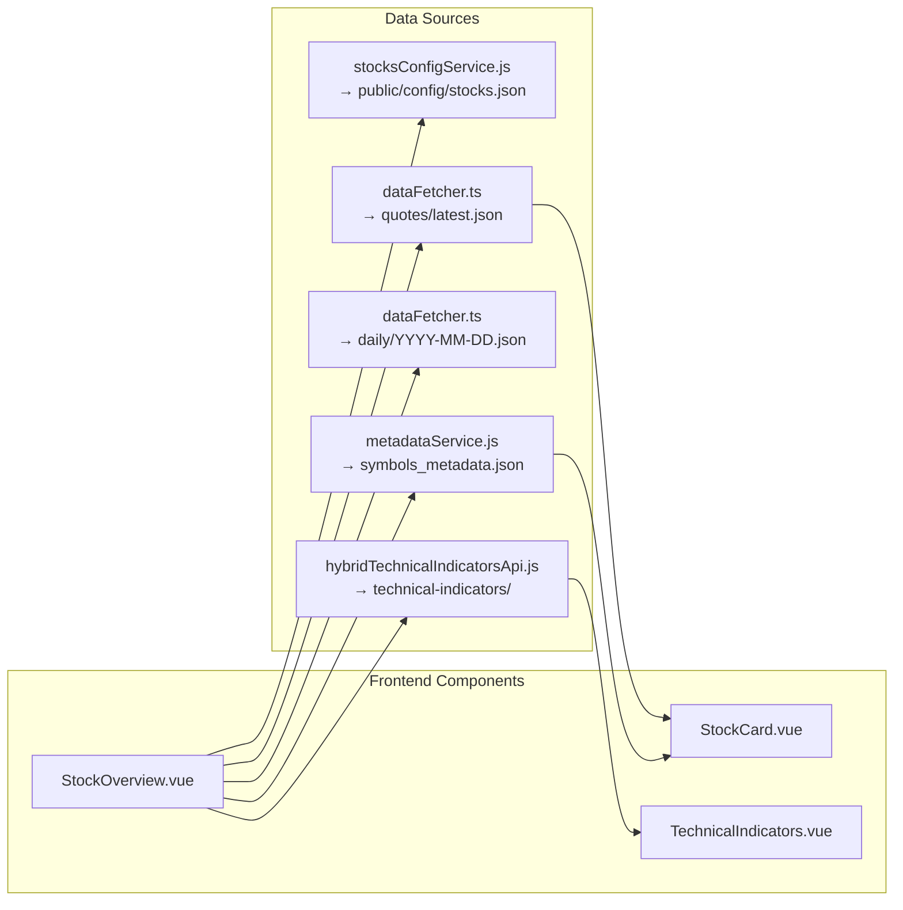
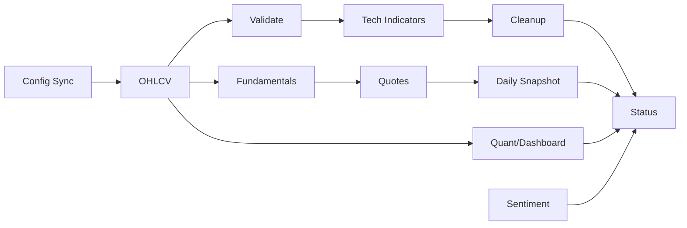
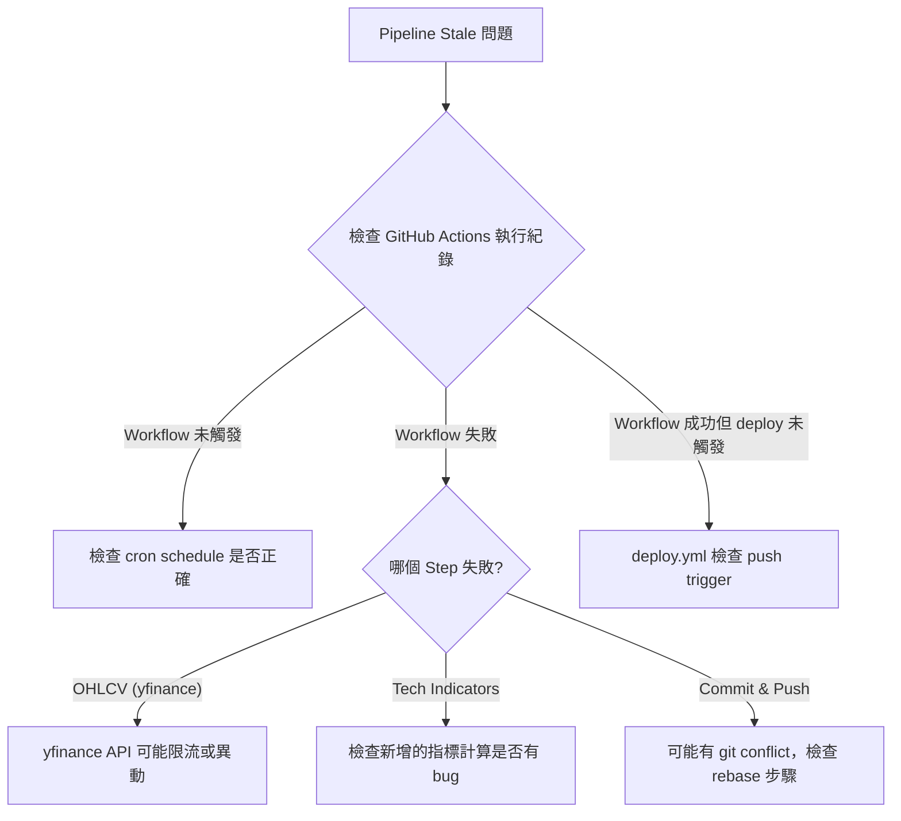
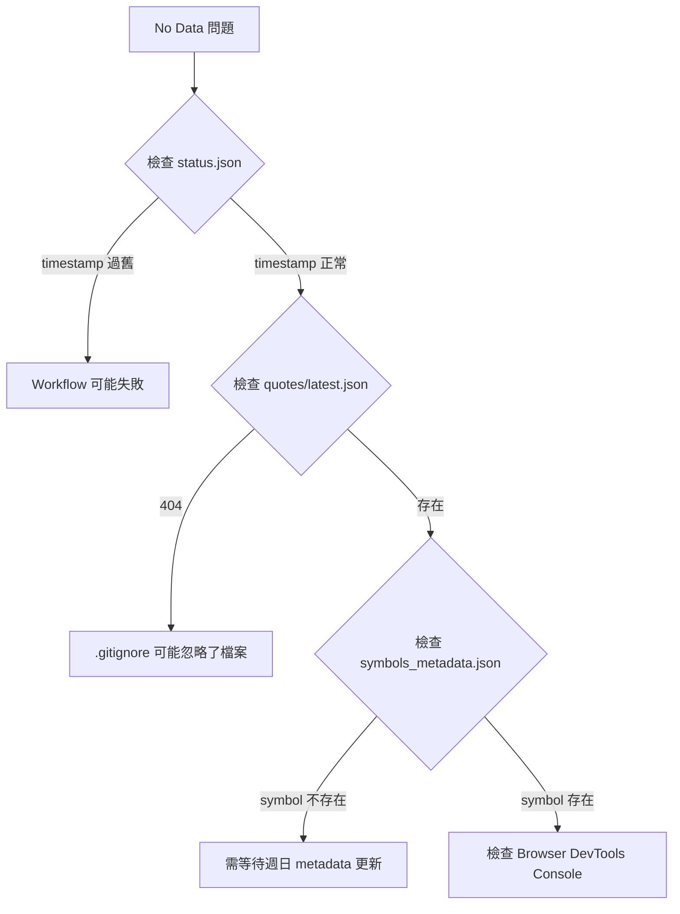
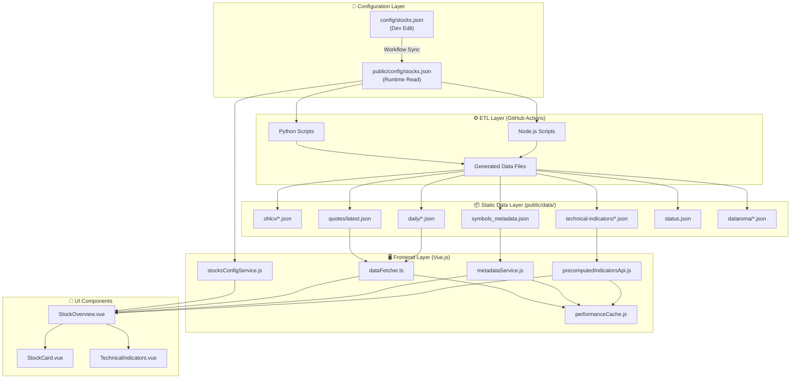

# Data Operations & Workflow

> [!IMPORTANT]
> This document serves as the **Single Source of Truth** for maintaining the data integrity of the Investment Dashboard. All future agents and developers must follow these procedures.
> 
> **最後更新**: 2026-02-12
> **維護者**: 當資料架構、處理流程、前後端互動流程、驗證機制有任何異動時，必須同步更新本文件。
> **自動維護**: 參見 `.agent/workflows/etl-docs-maintenance.md`

---

## 📋 Table of Contents

1. [Golden Rule: Config Source of Truth](#1-golden-rule-config-source-of-truth)
2. [Adding/Removing Stocks](#2-addingremoving-stocks)
3. [ETL Pipeline Architecture](#3-etl-pipeline-architecture)
4. [Data File Format Specifications](#4-data-file-format-specifications)
5. [Frontend Data Requirements](#5-frontend-data-requirements)
6. [GitHub Actions Workflows](#6-github-actions-workflows)
7. [Data Validation](#7-data-validation)
8. [Troubleshooting Guide](#8-troubleshooting-guide)
9. [Architecture Diagrams](#9-architecture-diagrams)
10. [ETL Scripts Inventory](#10-etl-scripts-inventory)
11. [Local ETL Testing Guide](#11-local-etl-testing-guide)

---

## 1. Golden Rule: Config Source of Truth

> [!CAUTION]
> 存在兩個設定檔，用途不同：

| 檔案路徑 | 用途 | 編輯時機 |
|---------|------|---------| 
| `config/stocks.json` | **開發階段編輯用** (Source of Edit) | 手動新增/移除股票時編輯此檔 |
| `public/config/stocks.json` | **前端執行時讀取** (Runtime Source) | **禁止手動編輯**，由 Workflow 自動同步 |

### Schema

```json
{
  "version": "2.0.0",
  "last_updated": "2026-02-08T00:00:00Z",
  "description": "統一股票配置文件 - 所有模組都參考此文件",
  "stocks": [
    {
      "symbol": "ASTS",
      "exchange": "NASDAQ",
      "sector": "Technology",
      "industry": "Communication Equipment",
      "enabled": true,
      "priority": 1,
      "visible": true
    }
  ],
  "metadata": {
    "total_stocks": 138,
    "enabled_stocks": 138,
    "exchanges": ["NYSE", "NASDAQ", "AMEX"],
    "sectors": ["Technology", "Healthcare", "..."]
  }
}
```

### 欄位說明

| 欄位 | 類型 | 必填 | 說明 |
|------|-----|------|------|
| `symbol` | string | ✅ | 股票代號 (大寫) |
| `exchange` | string | ✅ | 交易所: NYSE, NASDAQ, AMEX |
| `sector` | string | ✅ | 行業類別 (yfinance 格式) |
| `industry` | string | ✅ | 細分產業 (yfinance 格式) |
| `enabled` | boolean | ✅ | 是否啟用 (false = 不抓取數據) |
| `priority` | number | ❌ | 顯示優先順序 (1=最高) |
| `visible` | boolean | ❌ | 前端是否可見 (預設 true) |

---

## 2. Adding/Removing Stocks

### 新增股票 SOP



### 範例

```json
{
  "symbol": "NEW_STOCK",
  "exchange": "NASDAQ",
  "sector": "Technology",
  "industry": "Software - Application",
  "enabled": true,
  "priority": 2
}
```

---

## 3. ETL Pipeline Architecture

### 3.1 完整數據流程圖



### 3.2 完整排程表 (4 Workflows)

```
─────────────────────────────────────────────────────────────────────────
 Workflow                     │ Cron (UTC)       │ 台北時間    │ 觸發條件
─────────────────────────────────────────────────────────────────────────
 daily-data-update.yml        │ 0 2 * * *        │ 每日 10:00  │ schedule + workflow_dispatch
 dataroma-stock-update.yml    │ 0 0 * * *        │ 每日 08:00  │ schedule + workflow_dispatch
 update-metadata.yml          │ 0 2 * * 0        │ 週日 10:00  │ schedule + workflow_dispatch
 deploy.yml                   │ (event-driven)   │ -           │ push to main + workflow_dispatch
─────────────────────────────────────────────────────────────────────────
```

### 3.3 Timeflow：daily-data-update.yml (主要 ETL)

```
UTC 02:00 (台北 10:00) - Daily Workflow
├── Step 1:  Sync Config (config/ → public/config/) ──────────┬─ 0-1 min
├── Step 2:  Generate OHLCV (137 symbols × 5年, yfinance) ────┼─ 5-10 min
├── Step 3:  Validate OHLCV index (symbols 非空驗證) ──────────┼─ < 1 min
├── Step 4:  Generate Technical Indicators (137 × 30+) ────────┼─ 3-5 min
├── Step 5:  Cleanup old indicators (30天 retention) ──────────┼─ < 1 min
├── Step 6:  Update Metadata (僅週一執行) ─────────────────────┼─ 2-3 min
├── Step 7:  Fetch Fundamentals (yahoo-finance2) ─────────────┼─ 3-5 min
├── Step 8:  Generate Quotes Snapshot ─────────────────────────┼─ < 1 min
├── Step 9:  Generate Daily Snapshot ──────────────────────────┼─ < 1 min
├── Step 10: Generate Dashboard Status (Quant Signal) ─────────┼─ 1-2 min
├── Step 11: Update Sentiment (CNN F&G + Z-Score) ─────────────┼─ < 1 min
├── Step 12: Update Status File (health check) ────────────────┼─ < 1 min
└── Step 13: Commit & Push ────────────────────────────────────┴─ 1-2 min
```

### 3.4 Timeflow：dataroma-stock-update.yml

```
UTC 00:00 (台北 08:00) - Dataroma Workflow
├── Step 1: Crawl Dataroma Managers (Sector Rotation) ────────┬─ 1-2 min
├── Step 2: Crawl Dataroma Stock (PL, NVDA, TSLA) ────────────┼─ 1-3 min
└── Step 3: Commit & Push (skip ci) ──────────────────────────┴─ < 1 min
```

> [!WARNING]
> `dataroma-stock-update.yml` 的 tickers 為 **硬編碼** (`PL`, `NVDA`, `TSLA`)。
> 如需新增追蹤股票，須直接修改 workflow YAML 中的 `TICKERS` 陣列。

### 3.5 Timeflow：update-metadata.yml (週日)

```
UTC 02:00 Sunday (台北週日 10:00) - Weekly Metadata Workflow
├── Step 1: Update Sector/Industry (yfinance) ────────────────┬─ 5-10 min
├── Step 2: Update Metadata (yfinance) ───────────────────────┼─ 2-3 min
└── Step 3: Commit & Push ────────────────────────────────────┴─ 1 min
```

### 3.6 deploy.yml (事件驅動)

- **觸發**：`push to main` 或手動 `workflow_dispatch`
- **流程**：`npm ci` → `npm run build` → Upload to GitHub Pages → Deploy
- **不參與 ETL**，僅負責將 `dist/` 部署至 GitHub Pages

> [!IMPORTANT]
> 每次 daily-data-update 完成 commit & push 後，會觸發 `deploy.yml` 自動重新部署。
> 如果 daily-data-update 失敗未產生 commit，則 deploy **不會**被觸發，前端資料將停留在上次成功更新的日期。

---

## 4. Data File Format Specifications

### 4.1 OHLCV (`public/data/ohlcv/{SYMBOL}.json`)

> [!NOTE]
> 實際格式為平行陣列 (parallel arrays)，**非** Object Array。由 `generate-real-ohlcv-yfinance.py` 產出。

```json
{
  "timestamps": [1738886400000, 1738972800000, "..."],
  "open":       [125.50, 126.00, "..."],
  "high":       [127.30, 128.50, "..."],
  "low":        [124.80, 125.20, "..."],
  "close":      [126.80, 127.90, "..."],
  "volume":     [45000000, 42000000, "..."],
  "metadata": {
    "symbol": "NVDA",
    "period": "1d",
    "days": 1825,
    "generated": "2026-02-09T04:27:11Z",
    "source": "yfinance",
    "note": "Real market data for accurate MFI/VP calculations"
  }
}
```

**檔案命名規則**:

| 檔案名 | 說明 |
|-------|------|
| `{SYMBOL}.json` | 大寫主檔 (e.g. `NVDA.json`) |
| `{symbol}_{interval}_{days}d.json` | 小寫附檔 (e.g. `nvda_1d_1825d.json`) |
| `index.json` | 包含 symbols 清單，供前端 `getAvailableSymbols()` 使用 |

**特殊 Mapping (Benchmark)**:

| Yahoo Finance Ticker | 輸出檔名 | 用途 |
|----------------------|---------|------|
| `^GSPC` | `FOREXCOM_SPXUSD.json` | SPX Benchmark (Beta 計算) |
| `^VIX` | `TVC_VIX.json` | VIX 恐慌指數 |
| `TLT` | `NASDAQ_TLT.json` | 長期債券 ETF |
| `JNK` | `NASDAQ_JNK.json` | 高收益債 ETF |

### 4.2 Technical Indicators (`public/data/technical-indicators/`)

**檔案結構**:

| 檔案 | 說明 |
|------|------|
| `{YYYY-MM-DD}_{SYMBOL}.json` | 每日每檔完整指標 (含時間序列) |
| `latest_index.json` | 當前日期的 symbols 和 files 清單 |
| `latest_all.json` | **Bulk Compact** 檔 (最新值 + change%) |
| `market-sentiment.json` | Fear & Greed Index |

**完整指標清單** (30+ indicators):

| 類別 | 指標 | 維度 |
|-----|------|------|
| **Trend** | SMA (5, 10, 20, 30, 50, 60) | 6 |
| | EMA (5, 10, 20, 30, 50, 60) | 6 |
| | SuperTrend (10, ×3) | 1 |
| | Parabolic SAR | 1 |
| | VWMA (20) | 1 |
| | Ichimoku (Conv/Base/SpanA/SpanB/Lagging) | 5 |
| **Oscillators** | RSI (14) | 1 |
| | MACD (12, 26, 9) | 3 (line/signal/histogram) |
| | Stochastic (%K, %D) | 2 |
| | CCI (20) | 1 |
| | Williams %R (14) | 1 |
| | ADX (14) + DI+/DI- | 3 |
| **Volume** | OBV | 1 |
| | MFI (14) | 1 |
| | CMF (20) | 1 |
| **Volatility** | ATR (14) | 1 |
| **Beta** | Beta (10D vs SPX) | 1 |
| | Beta (3M/63D vs SPX) | 1 |
| | **Beta (1Y/252D vs SPX)** | 1 |

### 4.3 Quotes Snapshot (`public/data/quotes/latest.json`)

```json
{
  "generated": "2026-02-09T04:31:31Z",
  "count": 137,
  "items": [
    {
      "symbol": "NVDA",
      "price": 875.50,
      "change": 12.30,
      "changePercent": 1.42,
      "volume": 45000000,
      "previousClose": 863.20,
      "marketCap": 2150000000000,
      "timestamp": "2026-02-07T21:00:00Z"
    }
  ]
}
```

### 4.4 Daily Snapshot (`public/data/daily/{YYYY-MM-DD}.json`)

每日市場總覽聚合檔，由 `generate-daily-snapshot.js` 產生。包含每檔股票的簡要報價資訊。

### 4.5 Symbols Metadata (`public/data/symbols_metadata.json`)

```json
{
  "ttl_days": 7,
  "as_of": "2026-02-08T02:00:00Z",
  "items": [
    {
      "symbol": "NVDA",
      "sector": "Technology",
      "industry": "Semiconductors",
      "exchange": "NASDAQ",
      "market_cap": 2150000000000,
      "market_cap_category": "mega_cap",
      "confidence": 1.0,
      "sources": ["yfinance_python"]
    }
  ],
  "sector_grouping": {
    "Technology": ["NVDA", "MSFT", "..."],
    "Healthcare": ["JNJ", "..."]
  }
}
```

### 4.6 Status File (`public/data/status.json`)

前端 System Manager 頁面讀取此檔以判斷 Pipeline 是否正常。

```json
{
  "generated": "2026-02-09T04:31:43Z",
  "last_updated": "2026-02-09T04:31:43Z",
  "date": "2026-02-09",
  "status": "updated",
  "data_sources": {
    "ohlcv": { "exists": true, "fileCount": 560, "directory": "data/ohlcv/" },
    "technical_indicators": { "exists": true, "fileCount": 1939, "directory": "data/technical-indicators/" },
    "quotes": { "exists": true, "file": "data/quotes/latest.json" },
    "metadata": { "exists": true, "file": "data/symbols_metadata.json" },
    "daily_snapshot": { "exists": true, "file": "data/daily/YYYY-MM-DD.json" }
  },
  "update_info": {
    "source": "GitHub Actions Daily Update",
    "workflow": "daily-data-update.yml",
    "update_frequency": "daily"
  },
  "health_check": {
    "all_systems": "operational",
    "issues": []
  }
}
```

### 4.7 Dashboard Status (`public/data/dashboard_status.json`)

由 `scripts/production/daily_update.py` 產生。包含 Quant System 分析結果（Trend Continuation / Comet Signal）。

### 4.8 Dataroma Files

| 檔案 | 產出腳本 | 說明 |
|------|---------|------|
| `public/data/dataroma/{TICKER}.json` | `crawl_dataroma_stock.py` | 個股機構持股 |
| `public/data/smart_money_sector_rotation.json` | `crawl_dataroma_managers.py` | Smart Money Sector Rotation |
| `public/data/stock_sector_map.json` | `crawl_dataroma_managers.py` | 股票→Sector 映射 |

---

## 5. Frontend Data Requirements

### 5.1 StockOverview 頁面所需數據



### 5.2 必要數據欄位

| 組件 | 必要數據 | 來源 API |
|-----|---------|---------| 
| StockCard | symbol, price, change, changePercent | `fetchQuotesSnapshot()` |
| StockCard | sector, industry, exchange | `metadataService.getBatchMetadata()` |
| TechnicalIndicators | rsi, macd, ema, sma, atr, beta | `hybridTechnicalIndicatorsAPI.getTechnicalIndicators()` |
| GroupedStocks | sector 分組 | `symbols_metadata.json` → `sector_grouping` |

### 5.3 Sector 顯示 "Unknown" 的原因與解法

> [!WARNING]
> **問題**: 新增股票後，StockOverview 顯示 "Unknown" sector
> 
> **根因**: `symbols_metadata.json` 僅在**週日**由 `update-metadata.yml` 更新。新增的股票在下一個週日前不會有 metadata。
>
> **解法**: 
> 1. 確保 `config/stocks.json` 中新增股票時填寫正確的 `sector` 和 `industry`
> 2. 前端應優先使用 `stocks.json` 中的 sector/industry 作為 fallback

---

## 6. GitHub Actions Workflows

### 6.1 daily-data-update.yml (每日 UTC 02:00)

| 步驟 | 腳本 | 輸入 | 輸出 |
|-----|------|-----|------|
| Sync Config | `cp config/ → public/config/` | `config/stocks.json` | `public/config/stocks.json` |
| OHLCV | `generate-real-ohlcv-yfinance.py` | `public/config/stocks.json` | `public/data/ohlcv/*.json` |
| Validate OHLCV | inline Python | `ohlcv/index.json` | pass/fail |
| Technical Indicators | `generate-daily-technical-indicators.js` | OHLCV files + Benchmark | `technical-indicators/*.json`, `latest_all.json` |
| Cleanup | `cleanup-old-technical-indicators.js` | `--retention-days=30` | 刪除 >30 天的指標檔 |
| Metadata (週一) | `update-metadata-python.py` | yfinance API | `symbols_metadata.json` |
| Fundamentals | `fetch-fundamentals.js` | `public/config/stocks.json` | `public/data/fundamentals/*.json` |
| Quotes | `generate-quotes-snapshot.js` | config + OHLCV | `public/data/quotes/latest.json` |
| Daily | `generate-daily-snapshot.js` | quotes, indicators | `public/data/daily/YYYY-MM-DD.json` |
| Quant | `daily_update.py` | OHLCV + `scripts/core/` | `public/data/dashboard_status.json` |
| Sentiment | `update_sentiment.py` | CNN API + yfinance fallback | `market-sentiment.json` |
| Status | `update-status.js` | all files | `public/data/status.json` |

**依賴關係**:



### 6.2 update-metadata.yml (每週日 UTC 02:00)

| 步驟 | 腳本 | 輸入 | 輸出 |
|-----|------|-----|------|
| Sector/Industry | `update-sector-industry.py` | `public/config/stocks.json` | `symbols_metadata.json` |
| Metadata | `update-metadata-python.py` | yfinance API | 更新 `symbols_metadata.json` |

### 6.3 dataroma-stock-update.yml (每日 UTC 00:00)

| 步驟 | 腳本 | 輸入 | 輸出 |
|-----|------|-----|------|
| Sector Rotation | `crawl_dataroma_managers.py` | Dataroma web | `smart_money_sector_rotation.json`, `stock_sector_map.json` |
| Stock Crawl | `crawl_dataroma_stock.py` | `--ticker PL/NVDA/TSLA` | `public/data/dataroma/{ticker}.json` |

> [!CAUTION]
> Dataroma tickers 為**硬編碼**在 YAML 中：`TICKERS=("PL" "NVDA" "TSLA")`
> 需要新增追蹤個股時，直接編輯 `.github/workflows/dataroma-stock-update.yml`。

### 6.4 deploy.yml (Event-driven)

| 觸發 | 動作 |
|-----|------|
| `push to main` | `npm ci` → `npm run build` → Deploy to GitHub Pages |
| `workflow_dispatch` | 同上 (手動觸發) |

> [!NOTE]
> `deploy.yml` 使用 `concurrency: group: "pages"` 確保不會同時部署。
> commit message 含 `[skip ci]` 的推送 (如 Dataroma) **不會**觸發部署。

---

## 7. Data Validation

### 驗證指令

```bash
npm run validate:data           # 基本驗證
npm run validate:data --verbose # 詳細輸出
```

### 驗證項目

| 類別 | 檢查項目 |
|-----|---------| 
| OHLCV | `index.json` 含 symbols 陣列且非空；timestamps 嚴格遞增；各欄長度一致 |
| Technical Indicators | `latest_index.json` 存在；各 `{date}_{symbol}.json` 結構完整 |
| Fundamentals | `earnings`, `recommendationTrend` 結構正確 |
| Metadata | `symbols_metadata.json` 包含所有 enabled symbols |
| Quotes | `items` 陣列數量符合 `stocks.json` |
| Status | `status.json` 的 `health_check.all_systems` 為 `operational` |

---

## 8. Troubleshooting Guide

### 問題: Pipeline Status 顯示 "Stale"



### 問題: 前端顯示 "No Data"



### 問題: Sector 顯示 "Unknown"

1. 確認 `config/stocks.json` 中該 symbol 的 `sector` 欄位已正確填寫
2. 確認 `public/data/symbols_metadata.json` 包含該 symbol
3. 如不包含，需手動觸發 `update-metadata.yml` workflow

### 問題: 技術指標載入慢

1. 確認 `latest_all.json` 存在 (bulk 載入用)
2. 檢查 `hybridTechnicalIndicatorsApi.js` 是否正確呼叫 `getAllTechnicalIndicators()`
3. 檢查 Network Tab 是否發出大量個別請求 (應只有 1 個 bulk 請求)

---

## 9. Architecture Diagrams

### 9.1 完整系統架構



### 9.2 快取層級

```
┌─────────────────────────────────────────────────────────┐
│                    Frontend Cache Layers                 │
├─────────────────────────────────────────────────────────┤
│ L1: Memory Cache (performanceCache.js)                  │
│     TTL: 5 minutes                                       │
│     Keys: STOCK_OVERVIEW_DATA, QUOTES, METADATA         │
├─────────────────────────────────────────────────────────┤
│ L2: LocalStorage Cache (performanceCache.js)            │
│     TTL: 24 hours                                        │
│     Prefix: investment_dashboard_cache_v2_              │
├─────────────────────────────────────────────────────────┤
│ L3: Browser HTTP Cache                                   │
│     Busted by: ?t=timestamp query parameter             │
├─────────────────────────────────────────────────────────┤
│ L4: CDN / GitHub Pages Cache                            │
│     Busted by: new commit                               │
└─────────────────────────────────────────────────────────┘
```

---

## 10. ETL Scripts Inventory

### 10.1 Daily Production Scripts (每日 Workflow 使用)

| 腳本 | 語言 | 用途 | Workflow |
|------|------|------|---------|
| `generate-real-ohlcv-yfinance.py` | Python | 抓取 OHLCV 歷史數據 (yfinance) | daily-data-update |
| `generate-daily-technical-indicators.js` | Node.js | 計算 30+ 技術指標 | daily-data-update |
| `cleanup-old-technical-indicators.js` | Node.js | 清理 >30 天的指標檔 | daily-data-update |
| `fetch-fundamentals.js` | Node.js | 抓取基本面 (yahoo-finance2) | daily-data-update |
| `generate-quotes-snapshot.js` | Node.js | 產生報價快照 | daily-data-update |
| `generate-daily-snapshot.js` | Node.js | 產生每日總覽 | daily-data-update |
| `update-status.js` | Node.js | 產生 status.json | daily-data-update |
| `update_sentiment.py` | Python | Fear & Greed 指數 | daily-data-update |
| `production/daily_update.py` | Python | Quant 信號計算 | daily-data-update |

### 10.2 Metadata Scripts (週日/條件觸發)

| 腳本 | 語言 | 用途 | Workflow |
|------|------|------|---------|
| `update-metadata-python.py` | Python | 更新 yfinance metadata | update-metadata / daily (Mon) |
| `update-sector-industry.py` | Python | 更新 sector/industry | update-metadata |

### 10.3 Dataroma Scripts (每日獨立 Workflow)

| 腳本 | 語言 | 用途 | Workflow |
|------|------|------|---------|
| `crawl_dataroma_managers.py` | Python | Smart Money Sector Rotation | dataroma-stock-update |
| `crawl_dataroma_stock.py` | Python | 個股機構持股爬蟲 | dataroma-stock-update |

### 10.4 Core Modules (被 production scripts import)

| 模組 | 語言 | 用途 |
|------|------|------|
| `scripts/core/strategy_selector.py` | Python | QuantSystem, DataProvider, MarketRegime |

### 10.5 Utility/Dev Scripts (不在 Workflow 中)

| 腳本 | 語言 | 用途 |
|------|------|------|
| `check-json.js` | Node.js | JSON 格式驗證工具 |
| `debug-validation.js` | Node.js | 除錯用驗證 |
| `diagnose-performance.js` | Node.js | 效能診斷 |
| `precompute-indicators.js` | Node.js | 預計算指標 (legacy?) |
| `precompute-with-browser.js` | Node.js | 瀏覽器環境預計算 |
| `rebuild-metadata.js` | Node.js | 重建 metadata |
| `update-quotes.cjs` | Node.js | 更新報價 (legacy CJS) |
| `validate-data.js` | Node.js | 資料完整性驗證 |
| `verify-dashboard-panw.js` | Node.js | PANW 除錯驗證 |
| `verify-panw.js` | Node.js | PANW 數據驗證 |
| `backfill_sectors.py` | Python | 補齊 sector 資料 |
| `batch_crawl_dataroma.py` | Python | 批次 Dataroma 爬蟲 |
| `calc_fear_greed.py` | Python | 計算 Fear & Greed |
| `fetch_market_data.py` | Python | 市場數據抓取 |
| `generate_daily_report.py` | Python | 日報產生 |

---

## 11. Local ETL Testing Guide

### 11.1 完整 ETL 重跑 (本地)

```bash
# Step 1: Config Sync
cp config/stocks.json public/config/stocks.json

# Step 2: OHLCV (需要 Python 環境)
python scripts/generate-real-ohlcv-yfinance.py --days 1825 --interval 1d --min-rows 24

# Step 3: Technical Indicators
node scripts/generate-daily-technical-indicators.js

# Step 4: Cleanup (可選)
node scripts/cleanup-old-technical-indicators.js --retention-days=30 --verbose

# Step 5: Fundamentals
node scripts/fetch-fundamentals.js

# Step 6: Quotes Snapshot
node scripts/generate-quotes-snapshot.js

# Step 7: Daily Snapshot
node scripts/generate-daily-snapshot.js

# Step 8: Quant Dashboard
python scripts/production/daily_update.py

# Step 9: Sentiment
python scripts/update_sentiment.py

# Step 10: Status
node scripts/update-status.js
```

### 11.2 單一腳本測試

```bash
# 只重跑技術指標 (不需重抓 OHLCV)
node scripts/generate-daily-technical-indicators.js

# 只更新 metadata
python scripts/update-metadata-python.py

# 只更新 Fear & Greed
python scripts/update_sentiment.py

# 指定股票重抓 OHLCV
python scripts/generate-real-ohlcv-yfinance.py --symbols NVDA,TSLA
```

### 11.3 Python 環境需求

```bash
pip install yfinance pandas numpy requests pytz beautifulsoup4
```

### 11.4 Node.js 環境需求

```bash
npm ci
# 確保 yahoo-finance2 已安裝
```

---

## 📝 Changelog

| 日期 | 變更內容 |
|-----|---------|
| 2026-02-12 | **重大更新**：新增 §10 腳本清單、§11 本地測試指南、§3.4/3.6 完整 4-Workflow 排程、Dataroma/Deploy 文件化、修正 OHLCV 格式為 parallel arrays、指標新增 Beta 1Y |
| 2026-02-08 | 大幅擴充文件，新增 ETL 架構、數據格式、前端需求、時序圖 |
| 2026-02-07 | 修正 config 來源說明，釐清 config/ vs public/config/ |
| 2026-02-05 | 初版 Data Operations 文件 |

---

## 🔗 Related Documents

- [ADD_NEW_SYMBOL.md](./ADD_NEW_SYMBOL.md) - 新增股票 SOP
- [TECHNICAL_INDICATORS.md](./TECHNICAL_INDICATORS.md) - 技術指標說明
- [COMPONENT_DEPENDENCIES.md](./COMPONENT_DEPENDENCIES.md) - 組件依賴關係
- `.agent/workflows/etl-docs-maintenance.md` - Agent 自動維護規則
