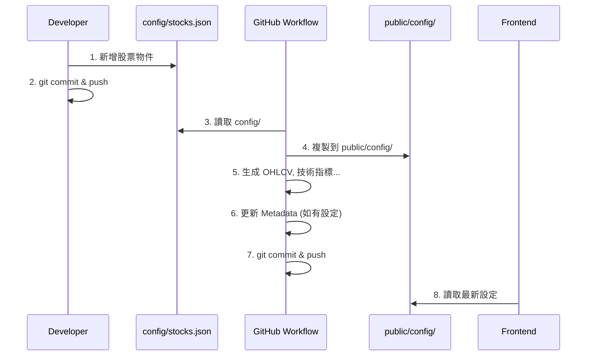
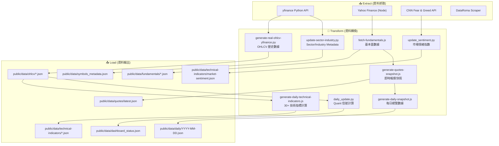
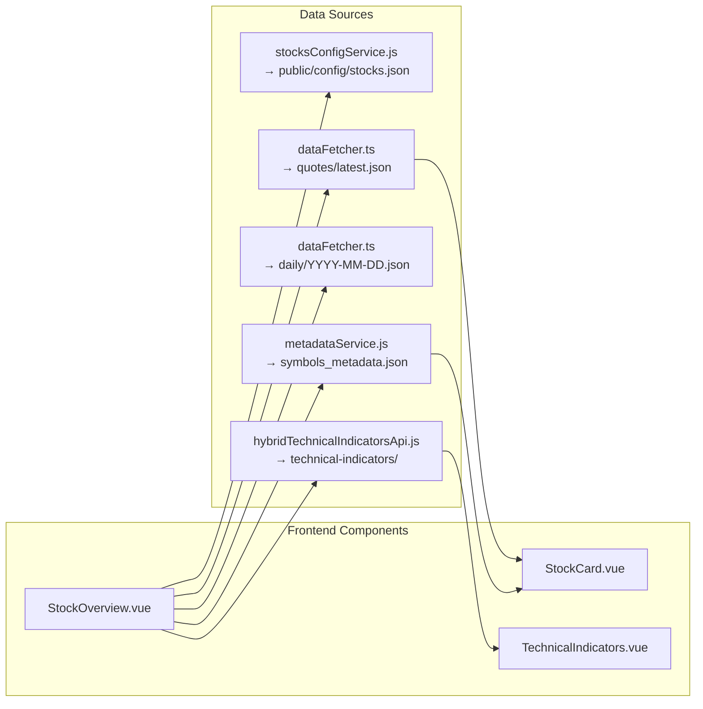
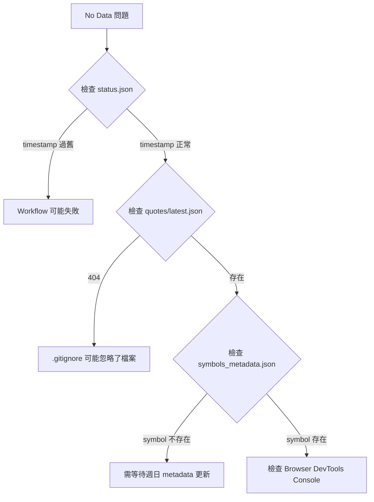
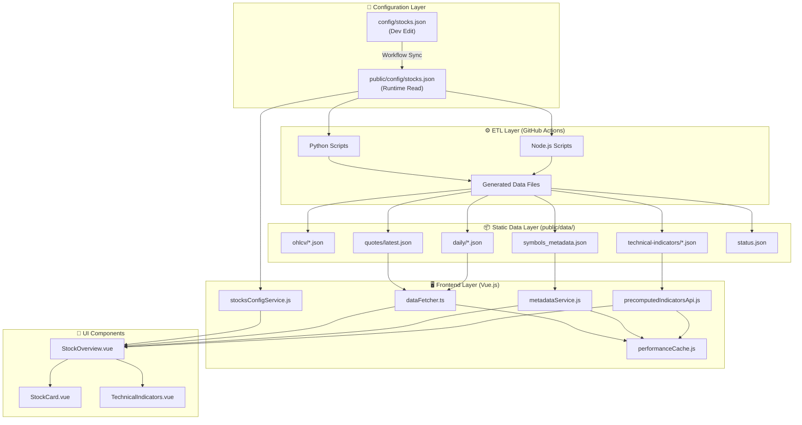

# Data Operations & Workflow

> [!IMPORTANT]
> This document serves as the **Single Source of Truth** for maintaining the data integrity of the Investment Dashboard. All future agents and developers must follow these procedures.
> 
> **最後更新**: 2026-02-08
> **維護者**: 當資料架構、處理流程、前後端互動流程、驗證機制有任何異動時，必須同步更新本文件。

---

## 📋 Table of Contents

1. [Golden Rule: Config Source of Truth](#1-golden-rule-config-source-of-truth)
2. [Adding/Removing Stocks](#2-addingremoving-stocks)
3. [ETL Pipeline Architecture](#3-etl-pipeline-architecture)
4. [Data File Format Specifications](#4-data-file-format-specifications)
5. [Frontend Data Requirements](#5-frontend-data-requirements)
6. [GitHub Actions Workflows](#6-github-actions-workflows)
7. [Data Validation](#7-data-validation)
8. [Troubleshooting Guide](#8-troubleshooting-guide)
9. [Architecture Diagrams](#9-architecture-diagrams)

---

## 1. Golden Rule: Config Source of Truth

> [!CAUTION]
> 存在兩個設定檔，用途不同：

| 檔案路徑 | 用途 | 編輯時機 |
|---------|------|---------|
| `config/stocks.json` | **開發階段編輯用** (Source of Edit) | 手動新增/移除股票時編輯此檔 |
| `public/config/stocks.json` | **前端執行時讀取** (Runtime Source) | **禁止手動編輯**，由 Workflow 自動同步 |

### Schema

```json
{
  "version": "2.0.0",
  "last_updated": "2026-02-08T00:00:00Z",
  "description": "統一股票配置文件 - 所有模組都參考此文件",
  "stocks": [
    {
      "symbol": "ASTS",
      "exchange": "NASDAQ",
      "sector": "Technology",
      "industry": "Communication Equipment",
      "enabled": true,
      "priority": 1,
      "visible": true
    }
  ],
  "metadata": {
    "total_stocks": 138,
    "enabled_stocks": 138,
    "exchanges": ["NYSE", "NASDAQ", "AMEX"],
    "sectors": ["Technology", "Healthcare", ...]
  }
}
```

### 欄位說明

| 欄位 | 類型 | 必填 | 說明 |
|------|-----|------|------|
| `symbol` | string | ✅ | 股票代號 (大寫) |
| `exchange` | string | ✅ | 交易所: NYSE, NASDAQ, AMEX |
| `sector` | string | ✅ | 行業類別 (yfinance 格式) |
| `industry` | string | ✅ | 細分產業 (yfinance 格式) |
| `enabled` | boolean | ✅ | 是否啟用 (false = 不抓取數據) |
| `priority` | number | ❌ | 顯示優先順序 (1=最高) |
| `visible` | boolean | ❌ | 前端是否可見 (預設 true) |

---

## 2. Adding/Removing Stocks

### 新增股票 SOP



### 範例

```json
{
  "symbol": "NEW_STOCK",
  "exchange": "NASDAQ",
  "sector": "Technology",
  "industry": "Software - Application",
  "enabled": true,
  "priority": 2
}
```

---

## 3. ETL Pipeline Architecture

### 3.1 完整數據流程圖



### 3.2 Timeflow (執行時序)

```
UTC 02:00 (台北 10:00) - Daily Workflow
├── Step 1: Sync Config (config/ → public/config/) ──────────┬─ 0-1 min
├── Step 2: Generate OHLCV (138 symbols × 5年) ──────────────┼─ 5-10 min
├── Step 3: Validate OHLCV index ────────────────────────────┼─ < 1 min
├── Step 4: Generate Technical Indicators (138 × 30+) ───────┼─ 3-5 min
├── Step 5: Cleanup old indicators (30 days retention) ──────┼─ < 1 min
├── Step 6: Update Metadata (Monday only) ───────────────────┼─ 2-3 min
├── Step 7: Fetch Fundamentals ──────────────────────────────┼─ 3-5 min
├── Step 8: Generate Quotes Snapshot ────────────────────────┼─ < 1 min
├── Step 9: Generate Daily Snapshot ─────────────────────────┼─ < 1 min
├── Step 10: Generate Dashboard Status (Quant) ──────────────┼─ 1-2 min
├── Step 11: Update Sentiment ───────────────────────────────┼─ < 1 min
├── Step 12: Update Status File ─────────────────────────────┼─ < 1 min
└── Step 13: Commit & Push ──────────────────────────────────┴─ 1-2 min

UTC 02:00 Sunday (台北週日 10:00) - Weekly Metadata Workflow
├── Step 1: Update Sector/Industry (yfinance) ───────────────┬─ 5-10 min
├── Step 2: Update Metadata ─────────────────────────────────┼─ 2-3 min
└── Step 3: Commit & Push ───────────────────────────────────┴─ 1 min
```

---

## 4. Data File Format Specifications

### 4.1 OHLCV (`public/data/ohlcv/{symbol}_1d_1825d.json`)

```json
{
  "symbol": "NVDA",
  "interval": "1d",
  "period": "1825d",
  "generated": "2026-02-08T02:15:00Z",
  "source": "yfinance",
  "ohlcv": [
    {
      "date": "2021-02-08",
      "open": 130.25,
      "high": 132.50,
      "low": 129.00,
      "close": 131.80,
      "volume": 45000000,
      "adjClose": 131.80
    }
  ]
}
```

### 4.2 Technical Indicators (`public/data/technical-indicators/{date}_{symbol}.json`)

```json
{
  "symbol": "NVDA",
  "computed_at": "2026-02-08T02:30:00Z",
  "indicators": {
    "trend": {
      "ema5": { "values": [...], "current": 125.5 },
      "ema10": { "values": [...], "current": 124.2 },
      "sma30": { "values": [...], "current": 120.1 },
      "supertrend": { "values": [...], "current": "bullish" }
    },
    "oscillators": {
      "rsi14": { "values": [...], "current": 65.2 },
      "macd": { "line": [...], "signal": [...], "histogram": [...] },
      "stoch": { "k": [...], "d": [...] }
    },
    "market": {
      "atr14": { "values": [...], "current": 5.2 },
      "obv": { "values": [...], "current": 1234567890 },
      "beta10d": 1.45,
      "beta3m": 1.32
    }
  },
  "pivots": {
    "classic": { "r3": 135, "r2": 132, "r1": 129, "p": 126, "s1": 123, "s2": 120, "s3": 117 }
  }
}
```

### 4.3 Quotes Snapshot (`public/data/quotes/latest.json`)

```json
{
  "generated": "2026-02-08T02:45:00Z",
  "count": 138,
  "items": [
    {
      "symbol": "NVDA",
      "price": 875.50,
      "change": 12.30,
      "changePercent": 1.42,
      "volume": 45000000,
      "previousClose": 863.20,
      "marketCap": 2150000000000,
      "timestamp": "2026-02-07T21:00:00Z"
    }
  ]
}
```

### 4.4 Daily Snapshot (`public/data/daily/{YYYY-MM-DD}.json`)

```json
{
  "date": "2026-02-08",
  "generated": "2026-02-08T02:50:00Z",
  "market_summary": {
    "gainers": 85,
    "losers": 53,
    "unchanged": 0
  },
  "per_symbol": [
    {
      "symbol": "NVDA",
      "sentiment": "bullish",
      "signal": "buy",
      "score": 78
    }
  ],
  "macro": {
    "vix": 15.2,
    "dxy": 104.5,
    "treasury_10y": 4.15
  }
}
```

### 4.5 Symbols Metadata (`public/data/symbols_metadata.json`)

```json
{
  "ttl_days": 7,
  "as_of": "2026-02-08T02:00:00Z",
  "items": [
    {
      "symbol": "NVDA",
      "sector": "Technology",
      "industry": "Semiconductors",
      "exchange": "NASDAQ",
      "market_cap": 2150000000000,
      "market_cap_category": "mega_cap",
      "confidence": 1.0,
      "sources": ["yfinance_python"]
    }
  ],
  "sector_grouping": {
    "Technology": ["NVDA", "AAPL", "MSFT", ...],
    "Healthcare": ["JNJ", "PFE", ...]
  }
}
```

### 4.6 Status File (`public/data/status.json`)

```json
{
  "generated": "2026-02-08T02:55:00Z",
  "status": "updated",
  "next_update": "2026-02-09T02:00:00Z",
  "data_sources": {
    "ohlcv": { "count": 138, "last_modified": "2026-02-08T02:20:00Z" },
    "technical_indicators": { "count": 138, "last_modified": "2026-02-08T02:35:00Z" },
    "quotes": { "count": 138, "last_modified": "2026-02-08T02:45:00Z" }
  },
  "health": {
    "overall": "healthy",
    "warnings": []
  }
}
```

---

## 5. Frontend Data Requirements

### 5.1 StockOverview 頁面所需數據



### 5.2 必要數據欄位

| 組件 | 必要數據 | 來源 API |
|-----|---------|---------|
| StockCard | symbol, price, change, changePercent | `fetchQuotesSnapshot()` |
| StockCard | sector, industry, exchange | `metadataService.getBatchMetadata()` |
| TechnicalIndicators | rsi, macd, ema, sma, atr, beta | `hybridTechnicalIndicatorsAPI.getTechnicalIndicators()` |
| GroupedStocks | sector 分組 | `symbols_metadata.json` → `sector_grouping` |

### 5.3 Sector 顯示 "Unknown" 的原因與解法

> [!WARNING]
> **問題**: 新增股票後，StockOverview 顯示 "Unknown" sector
> 
> **根因**: `symbols_metadata.json` 僅在**週日**由 `update-metadata.yml` 更新。新增的股票在下一個週日前不會有 metadata。
>
> **解法**: 
> 1. 確保 `config/stocks.json` 中新增股票時填寫正確的 `sector` 和 `industry`
> 2. 前端應優先使用 `stocks.json` 中的 sector/industry 作為 fallback

---

## 6. GitHub Actions Workflows

### 6.1 daily-data-update.yml (每日 UTC 02:00)

| 步驟 | 腳本 | 輸入 | 輸出 |
|-----|------|-----|------|
| Sync Config | `cp config/ → public/config/` | `config/stocks.json` | `public/config/stocks.json` |
| OHLCV | `generate-real-ohlcv-yfinance.py` | `public/config/stocks.json` | `public/data/ohlcv/*.json` |
| Technical Indicators | `generate-daily-technical-indicators.js` | OHLCV files | `technical-indicators/*.json`, `latest_all.json` |
| Fundamentals | `fetch-fundamentals.js` | `public/config/stocks.json` | `public/data/fundamentals/*.json` |
| Quotes | `generate-quotes-snapshot.js` | `config/stocks.json` | `public/data/quotes/latest.json` |
| Daily | `generate-daily-snapshot.js` | quotes, indicators | `public/data/daily/YYYY-MM-DD.json` |
| Quant | `daily_update.py` | OHLCV | `public/data/dashboard_status.json` |
| Sentiment | `update_sentiment.py` | CNN API | `market-sentiment.json` |
| Status | `update-status.js` | all files | `public/data/status.json` |

### 6.2 update-metadata.yml (每週日 UTC 02:00)

| 步驟 | 腳本 | 輸入 | 輸出 |
|-----|------|-----|------|
| Sector/Industry | `update-sector-industry.py` | `public/config/stocks.json` | `symbols_metadata.json`, `sector_industry.json` |
| Metadata | `update-metadata-python.py` | yfinance API | 更新 `symbols_metadata.json` |

---

## 7. Data Validation

### 驗證指令

```bash
npm run validate:data           # 基本驗證
npm run validate:data --verbose # 詳細輸出
```

### 驗證項目

| 類別 | 檢查項目 |
|-----|---------|
| OHLCV | symbol 存在、ohlcv 陣列非空、資料點結構正確 |
| Technical Indicators | rsi, macd, ema, sma 欄位存在、數值合理 |
| Fundamentals | earnings, recommendationTrend 結構正確 |
| Metadata | symbols_metadata.json 包含所有 enabled symbols |
| Quotes | items 陣列符合 stocks.json 數量 |

---

## 8. Troubleshooting Guide

### 問題: 前端顯示 "No Data"



### 問題: Sector 顯示 "Unknown"

1. 確認 `config/stocks.json` 中該 symbol 的 `sector` 欄位已正確填寫
2. 確認 `public/data/symbols_metadata.json` 包含該 symbol
3. 如不包含，需手動觸發 `update-metadata.yml` workflow

### 問題: 技術指標載入慢

1. 確認 `latest_all.json` 存在 (bulk 載入用)
2. 檢查 `hybridTechnicalIndicatorsApi.js` 是否正確呼叫 `getAllTechnicalIndicators()`
3. 檢查 Network Tab 是否發出大量個別請求 (應只有 1 個 bulk 請求)

---

## 9. Architecture Diagrams

### 9.1 完整系統架構



### 9.2 快取層級

```
┌─────────────────────────────────────────────────────────┐
│                    Frontend Cache Layers                 │
├─────────────────────────────────────────────────────────┤
│ L1: Memory Cache (performanceCache.js)                  │
│     TTL: 5 minutes                                       │
│     Keys: STOCK_OVERVIEW_DATA, QUOTES, METADATA         │
├─────────────────────────────────────────────────────────┤
│ L2: LocalStorage Cache (performanceCache.js)            │
│     TTL: 24 hours                                        │
│     Prefix: investment_dashboard_cache_v2_              │
├─────────────────────────────────────────────────────────┤
│ L3: Browser HTTP Cache                                   │
│     Busted by: ?t=timestamp query parameter             │
├─────────────────────────────────────────────────────────┤
│ L4: CDN / GitHub Pages Cache                            │
│     Busted by: new commit                               │
└─────────────────────────────────────────────────────────┘
```

---

## 📝 Changelog

| 日期 | 變更內容 |
|-----|---------|
| 2026-02-08 | 大幅擴充文件，新增 ETL 架構、數據格式、前端需求、時序圖 |
| 2026-02-07 | 修正 config 來源說明，釐清 config/ vs public/config/ |
| 2026-02-05 | 初版 Data Operations 文件 |

---

## 🔗 Related Documents

- [ADD_NEW_SYMBOL.md](./ADD_NEW_SYMBOL.md) - 新增股票 SOP
- [TECHNICAL_INDICATORS.md](./TECHNICAL_INDICATORS.md) - 技術指標說明
- [COMPONENT_DEPENDENCIES.md](./COMPONENT_DEPENDENCIES.md) - 組件依賴關係
