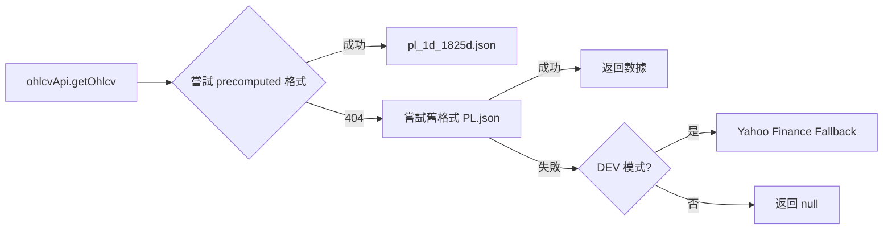

# 組件依賴追蹤文檔

> 最後更新: 2026-06-20

本文檔記錄前端組件與 API 服務之間的依賴關係，幫助開發者快速定位問題來源。

> **資料來源（2026-06，[ADR-0008](adr/0008-separate-data-repository.md)）**：所有 `data/...` JSON 已移至獨立資料倉庫 `investment-dashboard-data`（同源 GitHub Pages）。App 倉庫 git-ignore `public/data`，前端透過 `src/utils/baseUrl.js` 的 `withDataBase()`／`VITE_DATA_BASE_URL` 解析資料路徑。下表中的 `data/ohlcv/...` 路徑皆相對於該資料根目錄。本機開發請先執行 `npm run seed-data`（見 [DATA_REPO_SETUP.md](../contributing/DATA_REPO_SETUP.md)）。

---

## 📊 OHLCV 數據服務

專案中存在兩個 OHLCV 數據服務，功能相似但使用場景不同：

| 服務 | 路徑 | 檔案格式 | 使用情境 |
|------|------|----------|----------|
| `ohlcvApi` | `@/services/ohlcvApi.js` | `{symbol}_1d_1825d.json` | **主要服務**，所有用到 OHLCV 的組件皆使用 |
| `precomputedOhlcvApi` | `@/api/precomputedOhlcvApi.js` | `{symbol}_1d_{days}d.json` | 備用服務，**目前 0 個 import（死碼，可刪除候選）** |

### ohlcvApi 數據流



---

## 🔗 MFI Volume Profile 依賴鏈

### 實際使用的組件

```
StockDetail.vue
    └── MFIVolumeProfilePanel.vue  ✅ 被使用
            └── ohlcvApi (services/)
                    └── paths.ohlcvPrecomputed() → pl_1d_1825d.json
```

### 已移除（2026-02）

`MFIVolumeProfileWidget.vue` 已於 2026-02 移除（功能由 `MFIVolumeProfilePanel.vue` 取代，見下方清理記錄）。它是 `precomputedOhlcvApi` 的唯一消費者，因此該備用服務目前已 **0 個 import**（死碼，可刪除候選）。`SmartMoneyVolumeProfile.vue` 也使用主要的 `ohlcvApi`。

---

## 📋 組件與 API 對應表

| 組件 | 使用的 API | 數據來源 |
|------|-----------|----------|
| `MFIVolumeProfilePanel.vue` | `ohlcvApi` | `data/ohlcv/{symbol}_1d_1825d.json` |
| `SmartMoneyVolumeProfile.vue` | `ohlcvApi` | `data/ohlcv/{symbol}_1d_1825d.json` |
| `TrendlinesSRWidget.vue` | `ohlcvApi` | `data/ohlcv/{symbol}_1d_1825d.json` |
| `ZeiiermanFearGreedGauge.vue` | `ohlcvApi` | `data/ohlcv/{symbol}_1d_1825d.json` |
| `CisdWidget.vue` | `ohlcvApi` | `data/ohlcv/{symbol}_1d_1825d.json` |

---

## 🛠️ Debug 建議

### 當組件無法載入數據時

1. **確認組件被使用**
   ```bash
   # 搜尋哪個頁面 import 了該組件
   grep -r "import.*ComponentName" src/pages/ src/views/
   ```

2. **確認 API 來源**
   ```bash
   # 檢查組件使用哪個 API
   grep "import.*Api" src/components/ComponentName.vue
   ```

3. **確認 Network 請求**
   - 開啟 DevTools → Network Tab
   - 過濾 `.json`
   - 確認請求的 URL 與預期檔案格式一致

4. **確認檔案存在**
   ```bash
   # 檢查 precomputed 格式是否存在
   ls public/data/ohlcv/ | grep -i {symbol}
   ```

---

## 📝 清理記錄

### 2026-02-05 已移除的組件 (16 個)

以下組件經確認未被任何頁面使用，已安全移除：

| 組件 | 原因 |
|------|------|
| `MFIVolumeProfileWidget.vue` | 被 `MFIVolumeProfilePanel.vue` 取代 |
| `MFIVolumeProfileCanvas.vue` | 隨 Widget 一起移除 |
| `CustomFearGreedGauge.vue` | 被 `ZeiiermanFearGreedGauge.vue` 取代 |
| `TradingViewOverview.vue` | TradingView 舊版封裝 |
| `TradingViewTechnical.vue` | TradingView 舊版封裝 |
| `TradingViewTimeline.vue` | TradingView 舊版封裝 |
| `TradingViewFinancials.vue` | TradingView 舊版封裝 |
| `TradingViewFearGreedChart.vue` | TradingView 舊版封裝 |
| `TradingViewTickers.vue` | TradingView 舊版封裝 |
| `TradingViewTickerTape.vue` | TradingView 舊版封裝 |
| `TradingViewSymbolInfo.vue` | TradingView 舊版封裝 |
| `TradingViewStockHeatmap.vue` | TradingView 舊版封裝 |
| `TradingViewEconomicCalendar.vue` | TradingView 舊版封裝 |
| `TradingViewMarketOverview.vue` | TradingView 舊版封裝 |
| `TradingViewAdvancedChart.vue` | TradingView 舊版封裝 |
| `TopStoriesSkeleton.vue` | 未使用的骨架組件 |

### 2026-06 更新

- 資料來源遷移至獨立倉庫（[ADR-0008](adr/0008-separate-data-repository.md)）；前端改用 `withDataBase()` 解析路徑。
- 確認 `MFIVolumeProfileWidget.vue` 已移除；其唯一消費者 `precomputedOhlcvApi` 現已 0 個 import。
- 設計系統 token 化（[ADR-0010](adr/0010-design-system-css-tokens.md)）與雙語 i18n（[ADR-0011](adr/0011-bilingual-i18n-architecture.md)）已套用至全部組件，但不影響資料依賴關係，故不列於本表。

### 待處理項目

- [ ] 刪除死碼 `precomputedOhlcvApi.js`（已 0 import），或與 `ohlcvApi` 合併為單一服務
- [ ] 統一檔案命名格式 (目前有舊式 `{SYMBOL}.json` 與 `pl_1d_1825d.json` 兩種；歷史檔前端不應讀取，見 [DATA_DICTIONARY.md](../specs/DATA_DICTIONARY.md))
