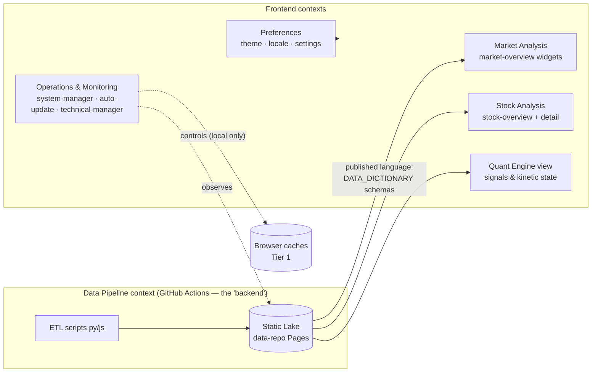

# BDD / DDD Gap Analysis — Investment Dashboard

> **Scope**: What behaviour-driven and domain-driven artifacts this project has, what is
> missing, and which gaps are worth closing for a solo-operator static-first product.
> Honesty rule: this is a frontend + CI-ETL repo with no runtime backend — tactical DDD
> (repositories, aggregates-with-invariants, domain events) would be ceremony without a
> domain layer to host it. The payoff here is **strategic** DDD (ubiquitous language,
> bounded contexts) and **executable** BDD (the PRD already writes Gherkin; nothing runs it).

## 1. Artifact inventory

| Artifact | Status before 2026-08 | Now / gap |
|---|---|---|
| Vision & Job Stories | ✅ PRD §1–2 (7 Job Stories) | kept — anchor layer |
| Per-surface user stories | ❌ none — Tools pages had no defined purpose (root cause of their drift) | ✅ [USER_STORIES.md](USER_STORIES.md) |
| User flows | ❌ none | ✅ [USER_FLOWS.md](USER_FLOWS.md) |
| State machines | ❌ none (states existed only implicitly in code, several fabricated) | ✅ [STATE_MACHINES.md](STATE_MACHINES.md) |
| Wireframes / UI grammar | ❌ none — no normative reference for "which header/button is correct" | ✅ [WIREFRAMES.md](WIREFRAMES.md) |
| Ubiquitous language | ⚠️ GLOSSARY.md exists, EN/繁中, enforced in docs — but missing the ops vocabulary (cache, scheduler, metadata, refresh…), which is exactly where the UI copy drifted to mainland register (audit CP-2) | add ops rows; UI copy must trace to it |
| Bounded-context map | ❌ none | §3 below |
| Acceptance criteria (Gherkin) | ⚠️ PRD §6 has 9 scenarios for F1/F2/F6/F11 — prose only, never executed, and F13 marked "Missing" is stale (test suite exists since ADR-0013/0015) | ✅ executable GWT framework (`features/` + `src/bdd/`), PRD F13 row corrected |
| Data contracts | ✅ specs/DATA_DICTIONARY.md + zod + contract tests | kept |
| ADRs / runbook / SLA | ✅ mature | kept |

## 2. Ubiquitous language — state and rules

GLOSSARY.md is the authority (its own scope line says the 繁中 column is "the authorized
translation for user-facing UI copy"). Two failure modes found by the audit:

1. **Coverage gap** → the Tools pages coined their own vocabulary (緩存/調度器/刷新/元數據)
   because the glossary had no row to follow. Fix: add the operations terms —
   Cache 快取 · Refresh 重新整理 · Metadata 中繼資料 · Scheduler 排程器 · Run 執行 ·
   Local (device) 本機 · Fallback 備援 · Sector 類股 · Industry 產業 · System Status 系統狀態.
2. **Enforcement gap** → nothing fails when UI copy contradicts the glossary. Fix: the GWT
   suite ships a terminology feature (`features/terminology.feature`) asserting zh-TW.json
   contains none of the banned-register forms (緩存, 調度器, 元數據, 保存配置, 運行狀態…)
   outside sanctioned contexts — the glossary becomes executable.

## 3. Bounded contexts (strategic map)

- **Published language**: the Static Lake JSON schemas (DATA_DICTIONARY + zod). The
  frontend contexts are *conformist* consumers — they must render what the lake says or an
  explicit Unknown, never re-interpret (the fabricated-status findings were OPS breaking
  this rule).
- **OPS context boundary (the audit's core lesson)**: on a static-first architecture OPS
  can *observe* the lake and *control* only browser-local caches. Any control implying
  pipeline-side effect is outside its boundary and must be a link to GitHub Actions, not a
  button pretending (SD-3/SD-4/FH-9).
- **Anti-corruption seams that already exist**: `withDataBase()` (one resolver rule —
  keep single, audit SD-14), locale formatting helpers (`dateFormat.ts`), zod parsing.
- **Signal codes are domain values, not display strings**: `WAIT/NO_DATA/NO_TRADE/...`
  belong to the QE context; presentation maps codes → localized copy (CP-1's fix is a
  context-boundary repair, not a translation chore).

## 4. BDD framework decision

**Choice: Gherkin `.feature` files as the spec-of-record + a light Given/When/Then harness
on vitest** (`src/bdd/gwt.ts`) that binds the automatable scenarios; browser-level
scenarios stay in Playwright e2e (already the a11y/e2e layer per ADR-0015).
Rejected: full cucumber-js — a second runner + glue layer for a solo repo duplicates what
vitest provides; the value is executable scenarios, not the cucumber toolchain.

Traceability: Job Story → user story (US-*) → `features/*.feature` scenario → binding test
(`*.feature.test.ts`) → CI. Scenarios not yet automatable are tagged `@manual` in the
feature file rather than silently dropped.

## 5. Remaining gaps (deliberately not closed now)

- **Tactical DDD layer** — not warranted; revisit only if a runtime backend (n8n / F15)
  materializes.
- **Event storming of the ETL** — the pipeline is linear and documented in
  DATA_OPERATIONS.md; a full event map adds little until multi-source orchestration lands.
- **Settings context** — stories US-SET1/2 define the honest minimum; product decision
  (implement vs remove) still belongs to the owner (PRD Open Question to add).
