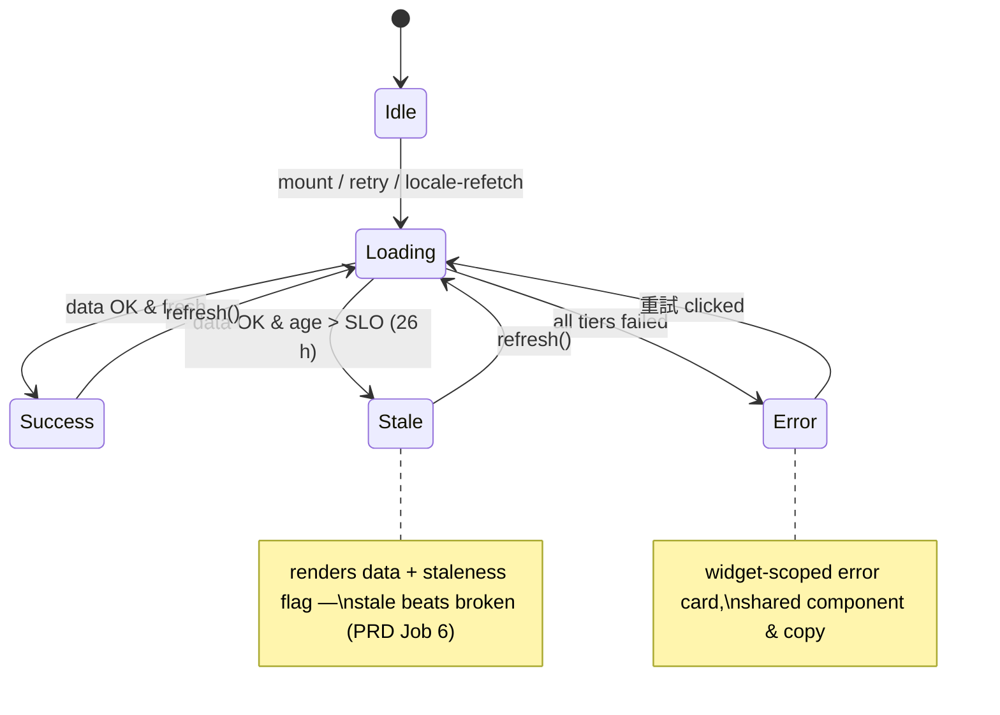
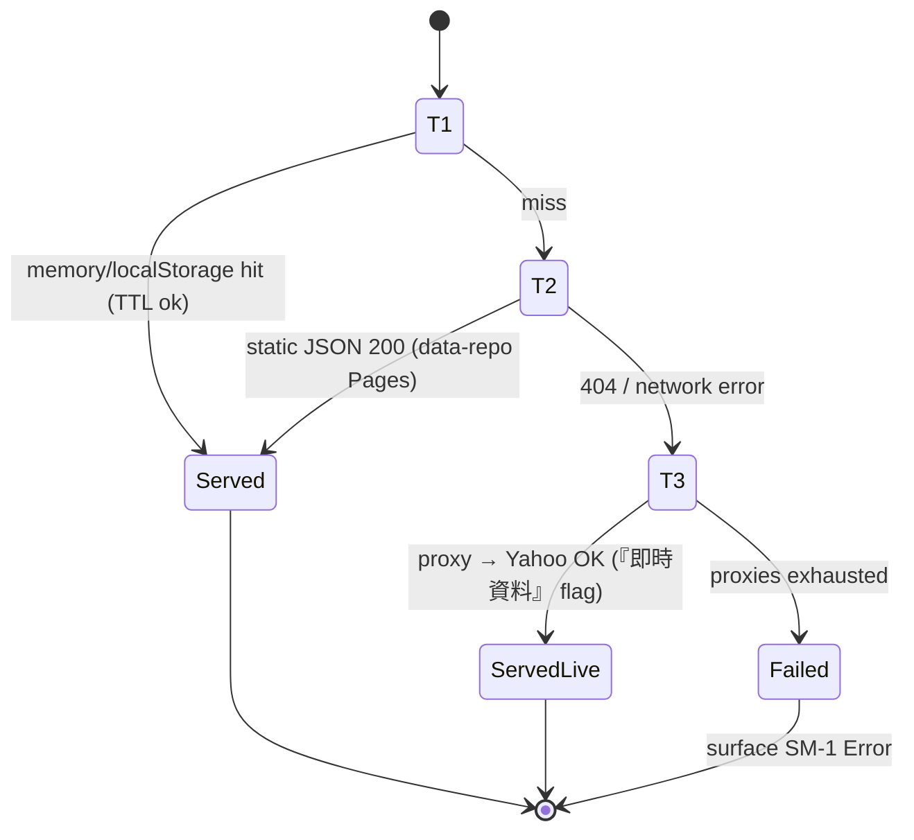
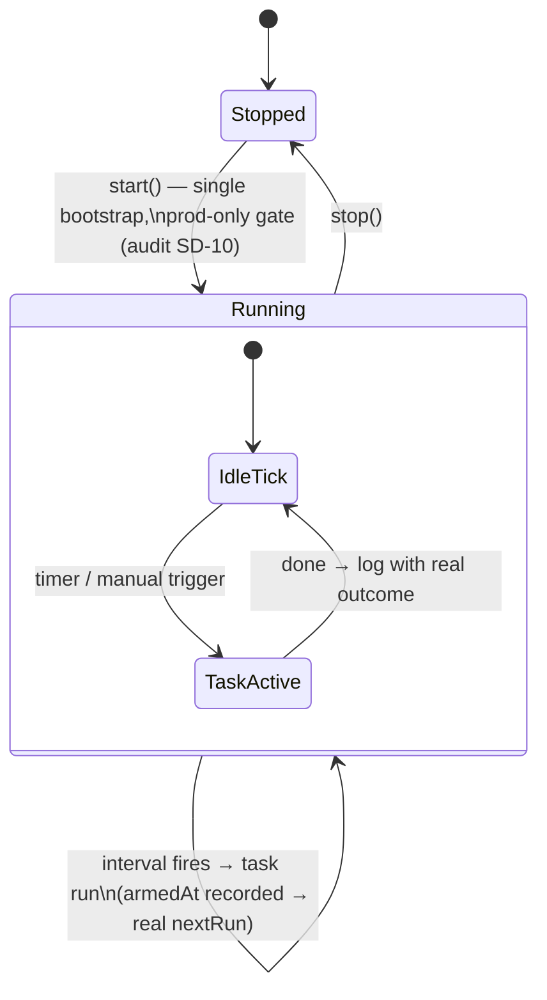
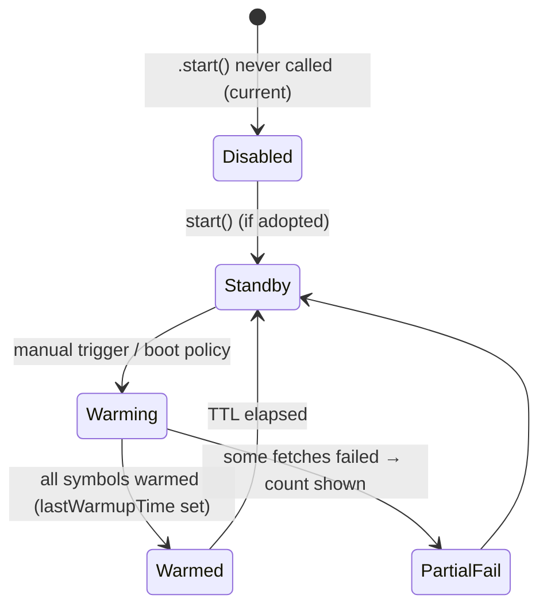
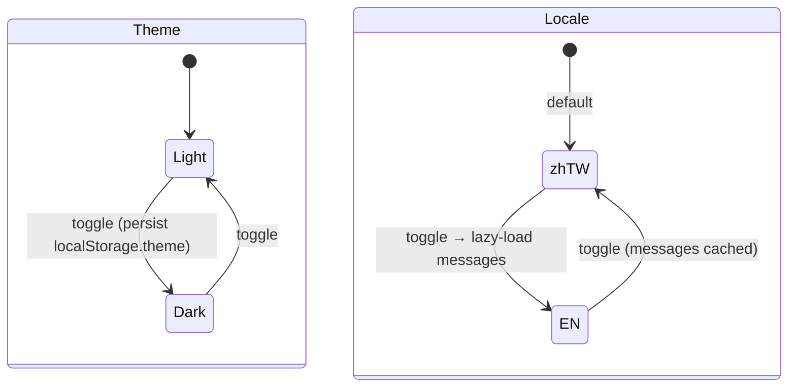
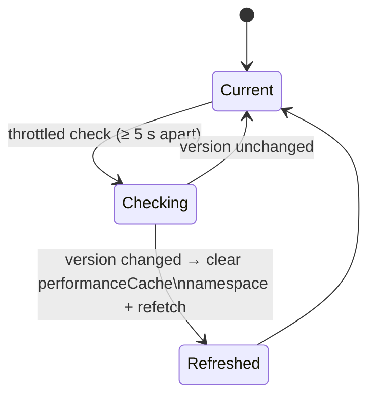

# State Machines — Investment Dashboard

> **Scope**: The finite states behind every dynamic surface, as `stateDiagram-v2`. These are
> normative: a widget/service may only be in one of its named states, and every transition
> names its trigger. The audit found several surfaces inventing un-named states (fabricated
> 過期/從未/0 on failed fetch; permanent 未預熱) — each machine below closes that class of
> bug by making *Unknown/Error* an explicit, renderable state.
> Executable scenario copies: `features/*.feature`.

## SM-1 · Widget data lifecycle (every data widget)

**Rules**: `Loading` must be gated on a *real* promise (no `setTimeout` simulation —
audit SD-8); `Error` is reachable (no dead retry UI — audit I4); no state renders
fabricated definite values (audit FH-8).

## SM-2 · 3-Tier cache resolution (per request; ADR-0003/0008)

## SM-3 · Auto-update scheduler (`autoUpdateScheduler.ts`)

**Rules**: exactly one bootstrap owner (`main.ts`); `nextRun = armedAt + interval`, never
`now + interval` (audit SD-2); a manual trigger pauses the 30 s poll instead of racing it
(audit I7); log level SUCCESS only when work occurred (audit SD-3).

## SM-4 · Cache warm-up service

**Rule**: while `Disabled`, the UI card must present the service as 手動 / 未啟用 — not as
a red error state (audit SD-7); tracked list derives from the universe config, not a
hardcoded array.

## SM-5 · Theme & locale (per-session preferences)

**Rule**: every rendered string, date and number derives from the active locale (audit
S1/X2); every color from theme-aware tokens.

## SM-6 · Data-version lifecycle (`dataVersionService`)

**Rule**: a throttled/no-op check must report "checked, unchanged / skipped (throttle)" —
not SUCCESS-cleared (audit SD-5).
