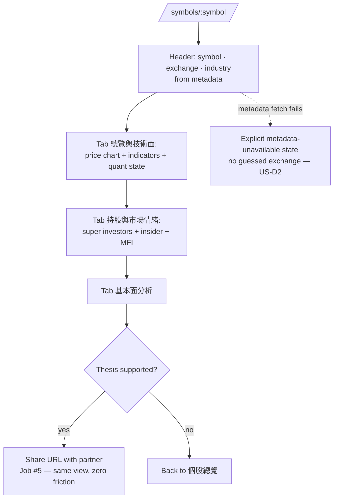
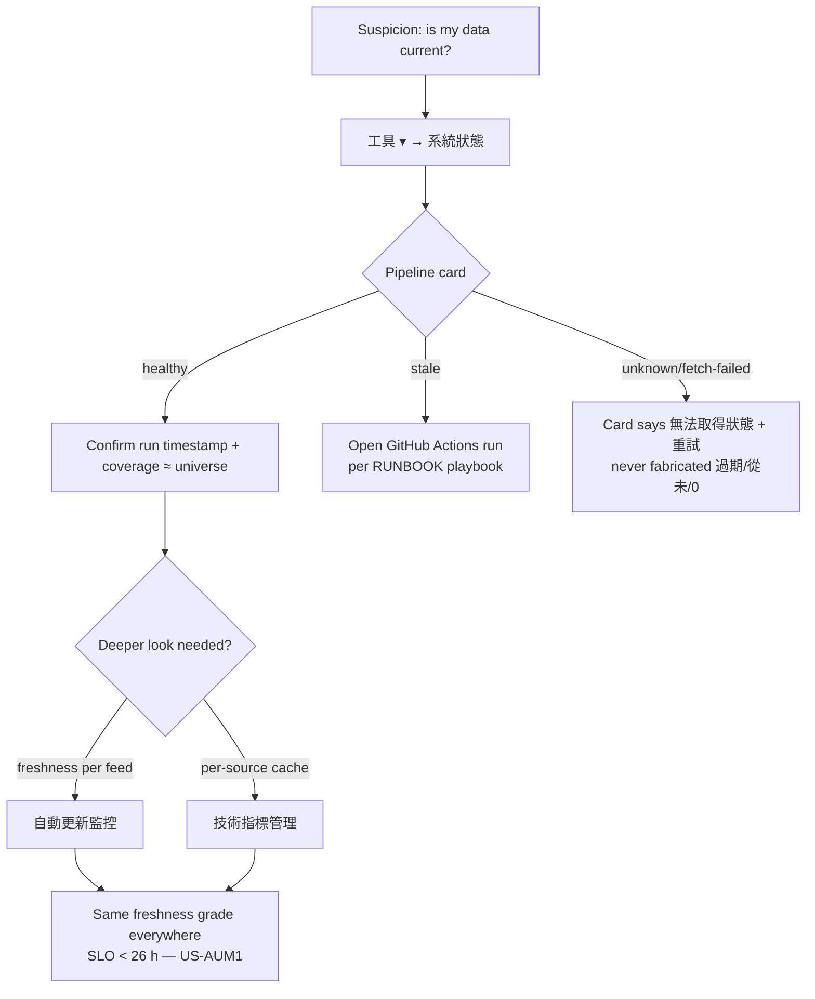
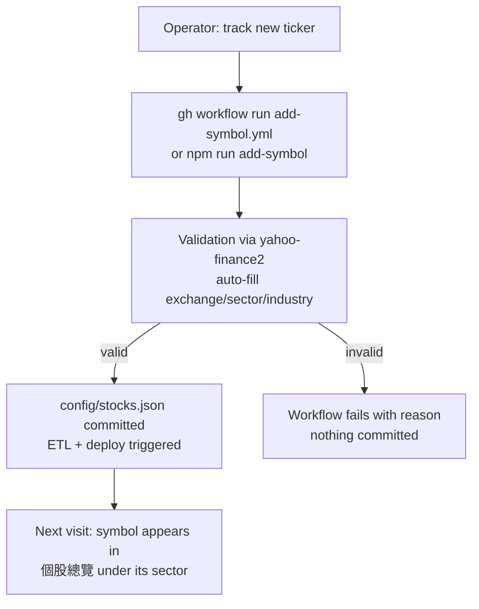
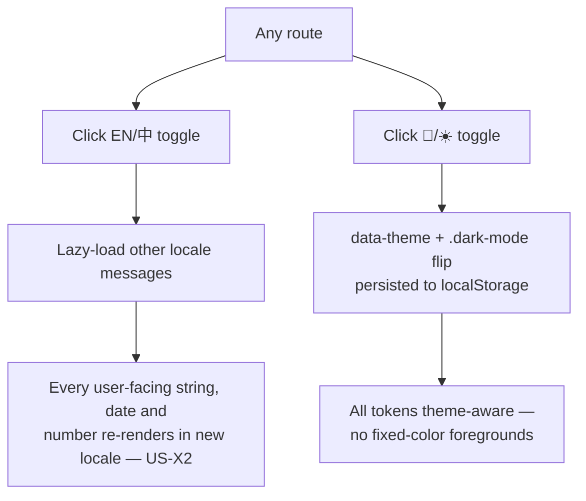
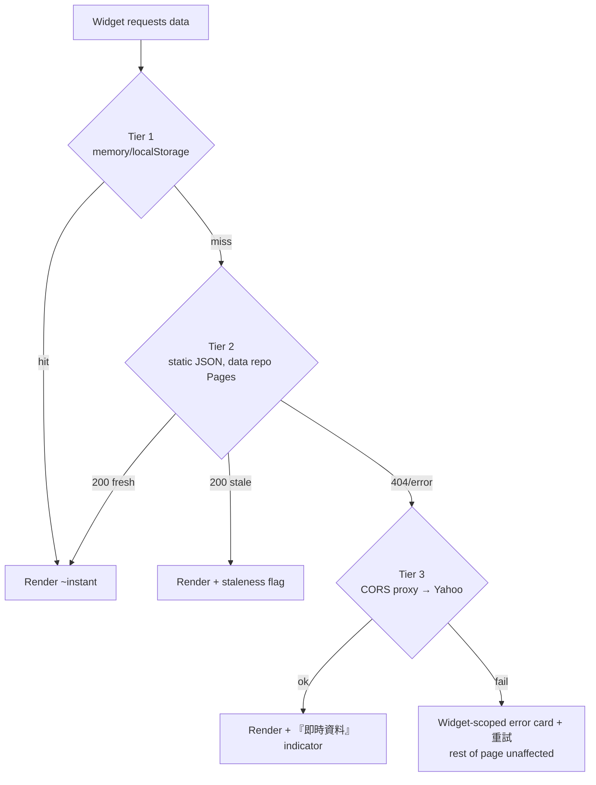

# User Flows — Investment Dashboard

> **Scope**: The expected end-to-end paths through the product, as flow diagrams. Each flow
> names its Job Story anchor (PRD §2) and its failure branches — a flow that only shows the
> happy path is a wish, not a spec. Widget-level state transitions live in
> [STATE_MACHINES.md](STATE_MACHINES.md); per-surface stories in [USER_STORIES.md](USER_STORIES.md).

## F1 · Morning scan (Job #1, #4)

```mermaid
flowchart TD
    A[Open app] --> B[/ redirects to /market-overview/]
    B --> C{Data fresh?<br/>pipeline < 26 h}
    C -- yes --> D[Scan indices · VIX · regime · news]
    C -- stale --> D2[Same scan + staleness banner<br/>『資料可能過期 — 最後更新 {ts}』]
    D --> E[Switch to /stock-overview]
    D2 --> E
    E --> F[Scan sector groups for<br/>Launchpad / Climax / Dip-Buy badges]
    F --> G{Candidate found?}
    G -- yes --> H[Open /stock-overview/symbols/:sym]
    G -- no --> I[Done — no trade today]
```

**Failure branches**: any single widget unreachable → widget-scoped error card + 重試
(page stays interactive, PRD F6); *all* data unreachable → every widget in error state,
nav/theme/locale still work.

## F2 · Single-stock triage (Job #2, #3)



## F3 · Operational health check (Job #6) — Operator-as-Maintainer



**Contract**: all three Tools pages grade the same feed identically; every control's label
states its blast radius; SUCCESS log entries only for work actually performed.

## F4 · Add a symbol (Job #7)



## F5 · Locale & theme (F16)



## F6 · Stale-data degradation (Job #6, PRD F6/F9)



**Invariant** (PRD Job #6): stale beats broken; broken is loud; nothing renders a
fabricated value.
